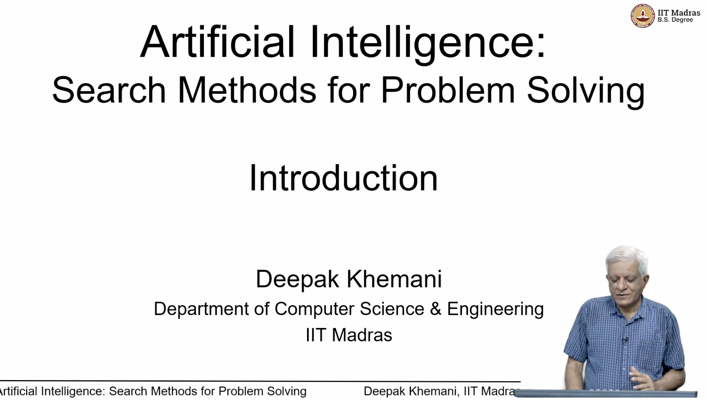
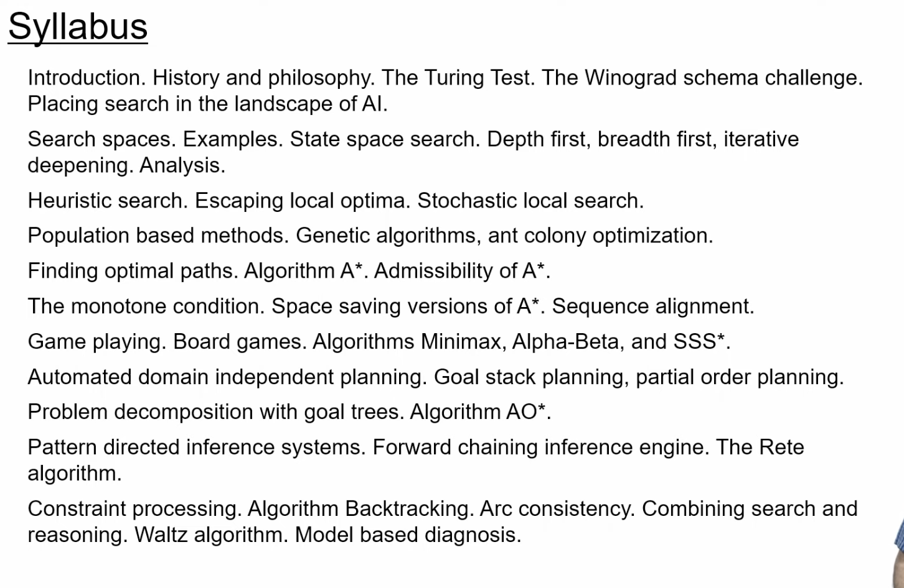
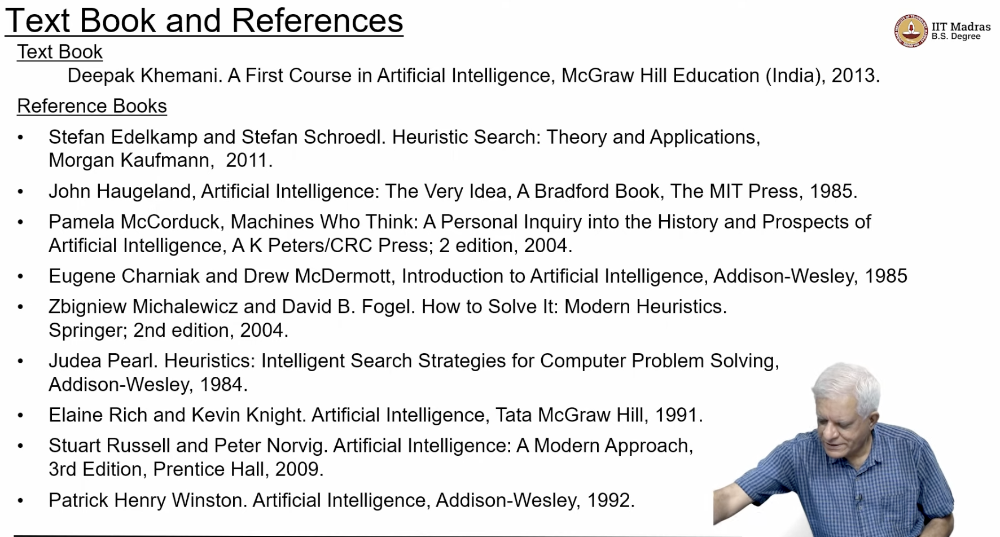
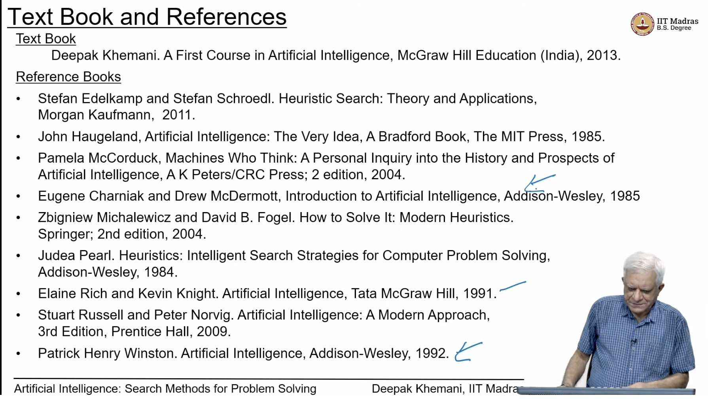
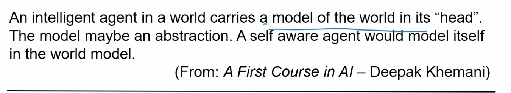
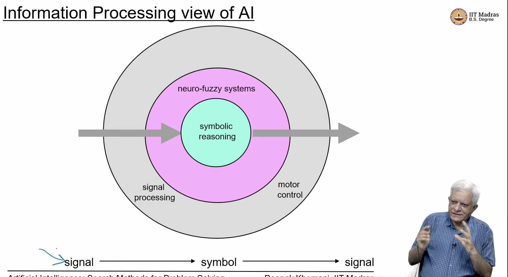
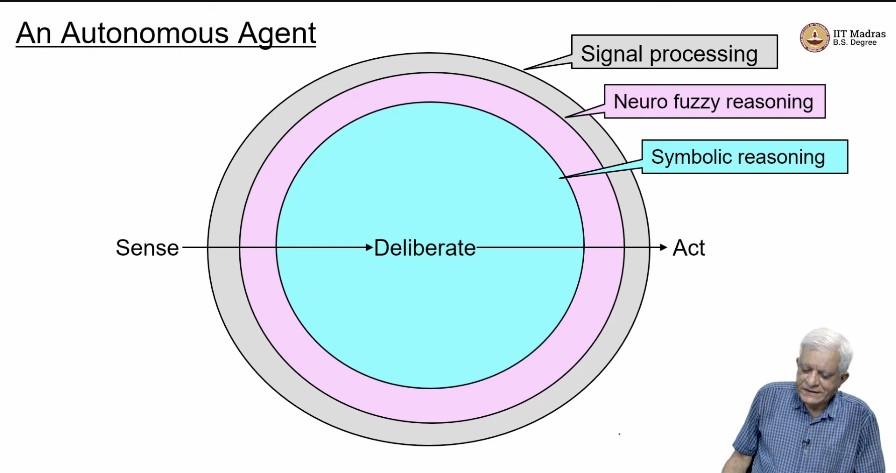
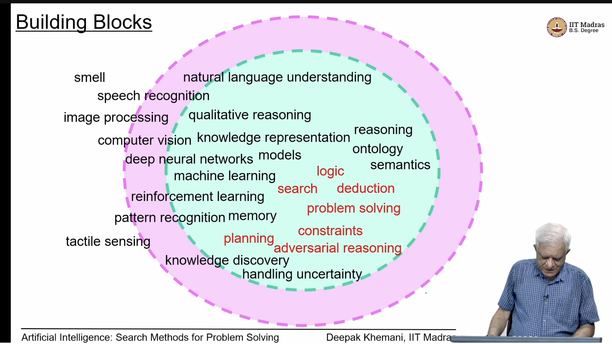
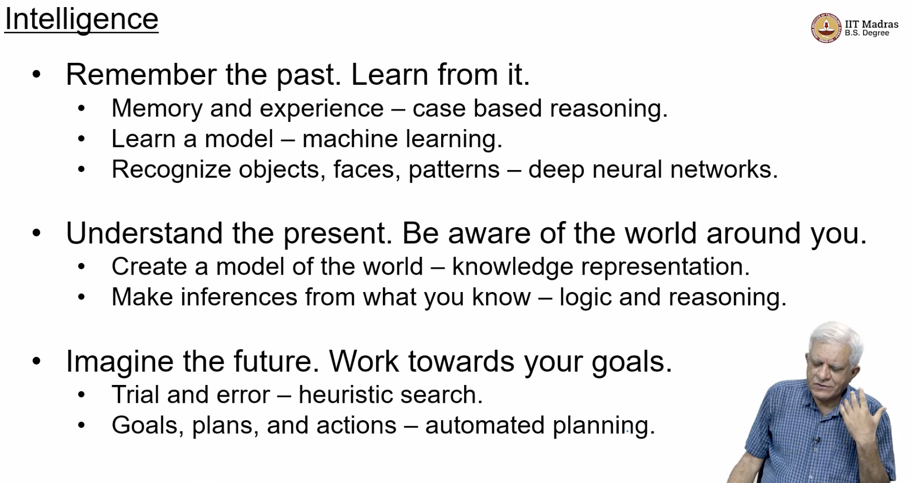

## Introduction

- History and philosophy of AIs
- Syllabus
    - turing test
        - [ ] [Turing test](https://en.wikipedia.org/wiki/Turing_test)
        - it means that if a human can't distinguish between a human and a machine, then the machine is intelligent
    - Winograd schema challenge
        - [ ] [Winograd schema challenge](https://en.wikipedia.org/wiki/Winograd_Schema_Challenge)
        - it is a test of machine's ability to understand context, and not just words
    - Chinese room argument
        - [ ] [Chinese room argument](https://en.wikipedia.org/wiki/Chinese_room)
        - it is a thought experiment that says that a computer can't think, it can only manipulate symbols without understanding their meaning, just like a person in a room who doesn't understand Chinese, but can manipulate Chinese symbols to give the right answer

- books studied by proff when he was starting

- what is an intelligent Agent?(We want to design an intelligent agent which means a program that is)
    - Persistent - available always
    - Autonomous - acts independently
    -  Proactive - can decide what goals to achieve next    
    - goal directed -can also be given by humans

- the model maybe an abstraction of the real world, but it should be able to predict the real world

- the outermost layer must be able to process the signals
- they are converted to symbols and then to concepts
- it has to act in the real world, this is sending signals to the real world

- neuro fuzzy systems
    - neural networks
- innermost layer is the knowledge base, symbolic reasoning
- so an autonomous agent senses the world, creates an internal model on which it deliberates , and then acts on the world
- the relative size of the image is to emphasize that the knowledge base is the most important part

- The ai is not one algorithm, it is a collection of algorithms

- if we want to build an intelligent agent, we need to be able to
    - sense
        - smell
        - speech recognition
        - image processing
        - computer vision
        - tactile sensors (touch) - to pick up objects
    - Neural networks (instrumental in transforming a signal to a symbol)
        - DNN
        - ML
        - RL
        - pattern recognition
        - knowlede discovery
        - handling uncertainty
        - nlu - natural language understanding
    - green part  is symbolic reasoning (knowledge representation)
        - models
        - memory (remember things)
        - reasoning
        - ontologies - a set of concepts and categories in a subject area or domain that shows their properties and the relations between them, and is used as a knowledge base to reason about the world
            - eg - a car has a steering wheel and a steering wheel has a wheel and a wheel has a tyre and a tyre has a tube and a tube has a valve and a valve has a cap 
        - logic
        - deduction
        - semantics
        - qualitative reasoning

- We will see   
    - logic and deduction
    - search, problem solving,
    - constraints 
    - planning
    - adversarial reasoning
    - constraint satisfaction
- there are other things
    - natural language generation
    - speech synthesis
    - graphics
    - robot control

- What is intelligence ?
