## A Decade of Machine Learning
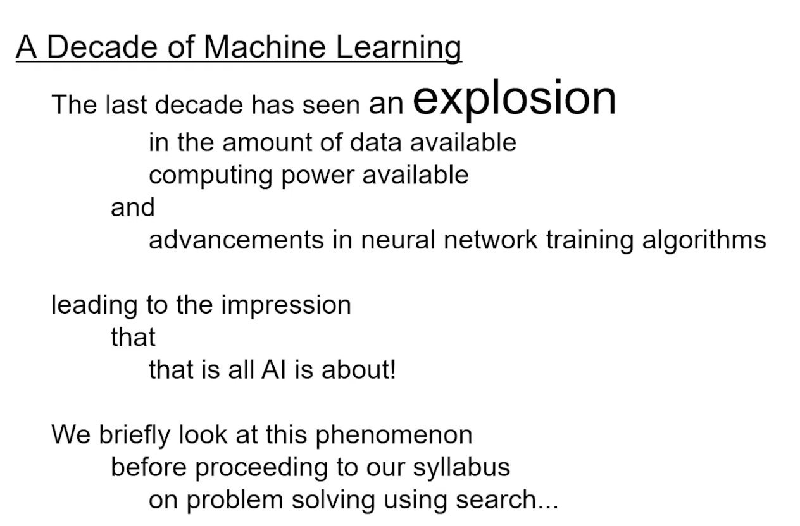
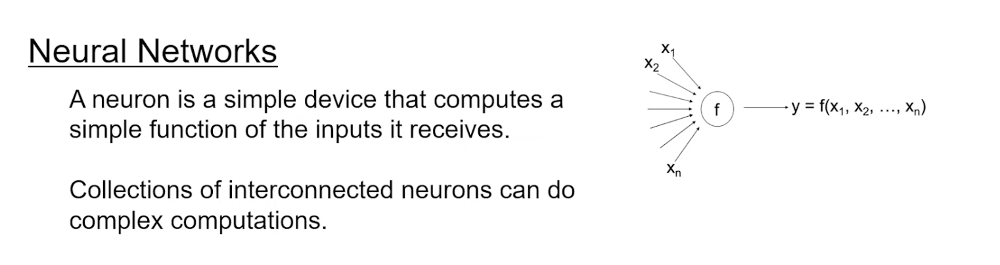
    - the function is non linear, typically a sigmoid function
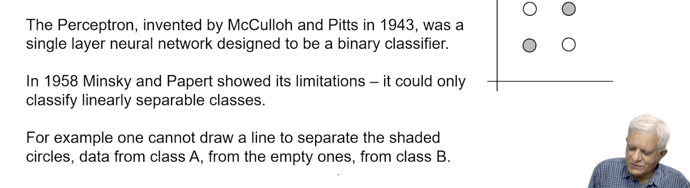
- feed forward neural network
    - the input is fed to the first layer
    - the output of the first layer is fed to the second layer
    - the output of the second layer is fed to the third layer

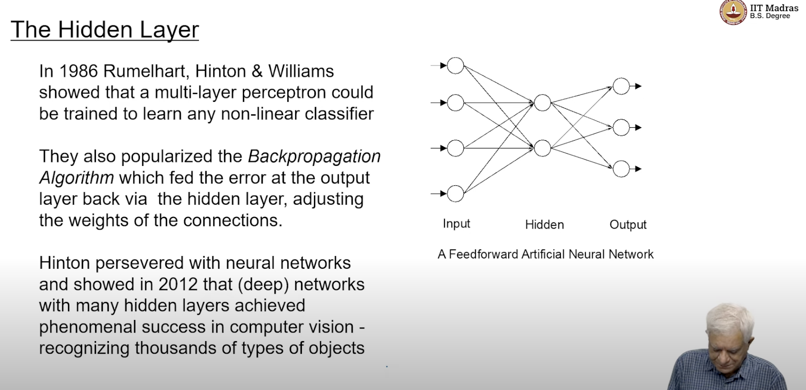
- DNN with many hidden layers are very powerful and they achieve very good results in computer vision and speech recognition

- There are only 2 neurons in the hidden layer, in the picture above
- the input number of neurons will depend on the size of the input that we are taking, for eg if its an image of 10x10, then we will have 100 neurons in the input layer, as there will be 100 pixels
- output will show the probability of the image being a cat or a dog
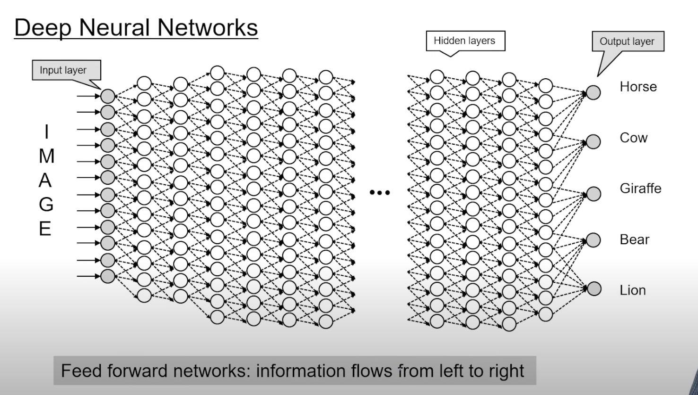

- feed forward neural network
    - the information flows from the input to the output, left to right

- this happens through a process called training , (backpropagation algorithm)
- this is supervised learning
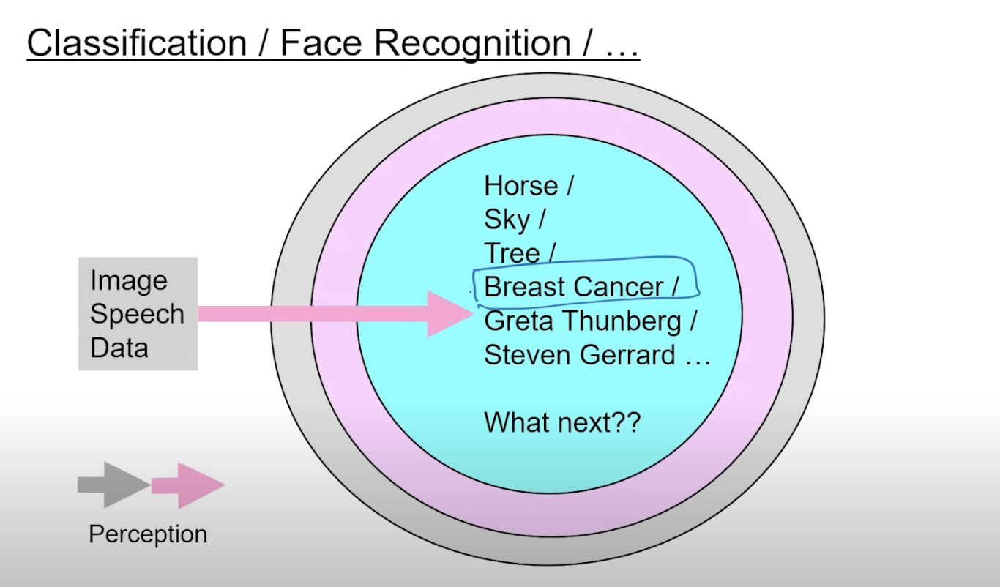
- why deep learning is good in diagnosing?
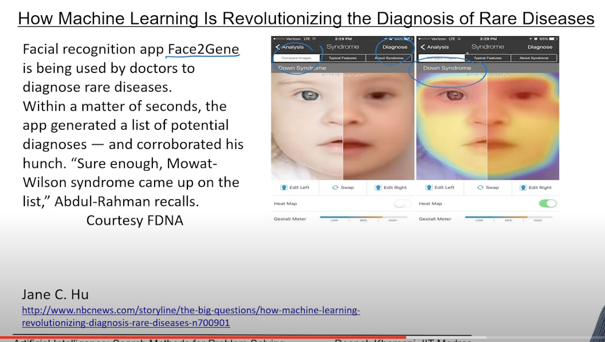
- Jane C. Hu, “The AI Detectives”, Slate, 2017, https://slate.com/technology/2017/05/why-are-deep-learning-systems-so-good-at-finding-things.html
- https://www.nbcnews.com/storyline/the-big-questions/how-machine-learning-revolutionizing-diagnosis-rare-diseases-n700901

- all that we are doing is image labelling
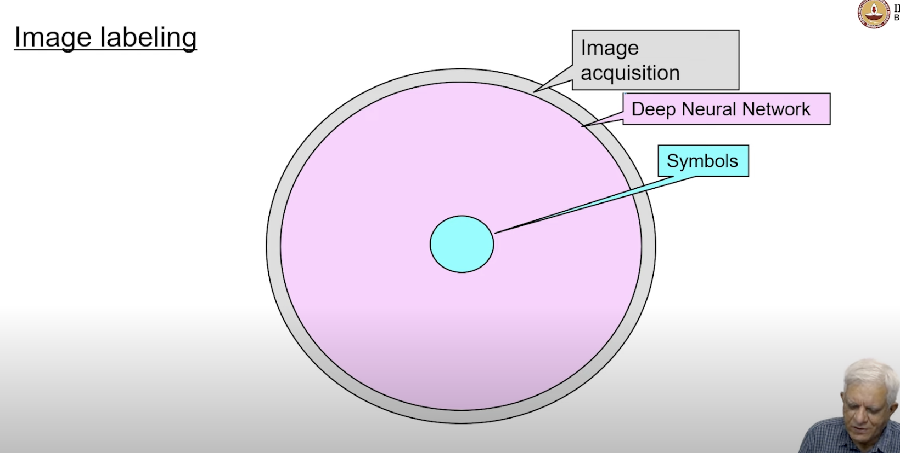
- the intermediate region has become bigger and the inner region has become smaller, this is because of the non linear activation function, and its the architecture of the neural network
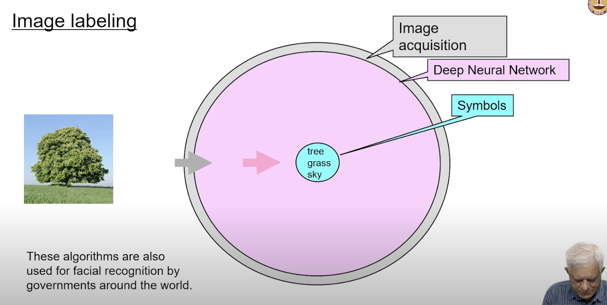

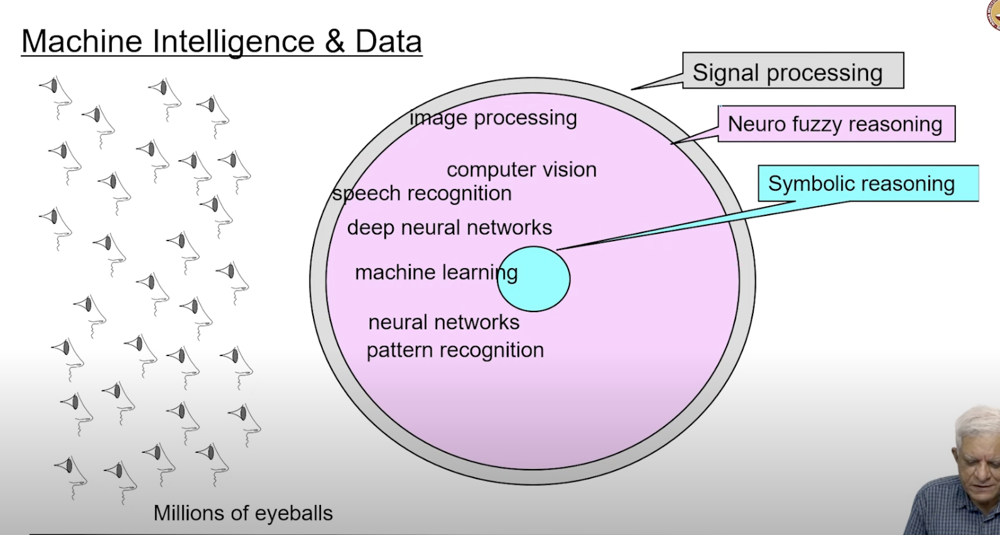
- in general the users are also data, and the companies are classifying the users, when we interact with the companies, they are collecting data about us, and they are using that data to classify us
- `i think therefore i am` - Rene Descartes
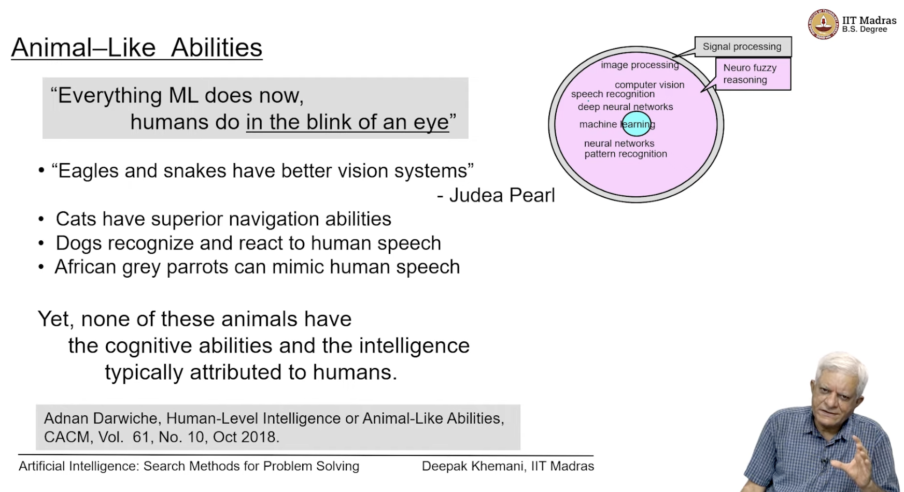
- humans are different from animals because of the cognitive abilities
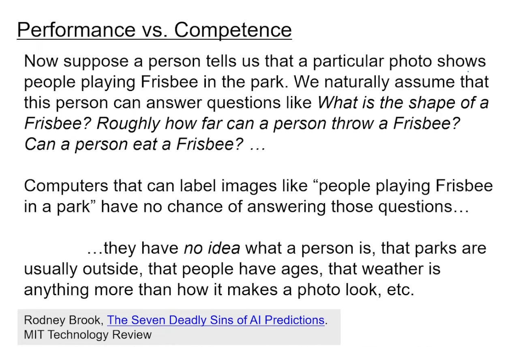
- https://www.technologyreview.com/s/609048/the-seven-deadly-sins-of-ai-predictions/?utm_campaign=site_visitor.unpaid.engagement&utm_source=linkedin&utm_medium=add_this&utm_content=2019-03-23
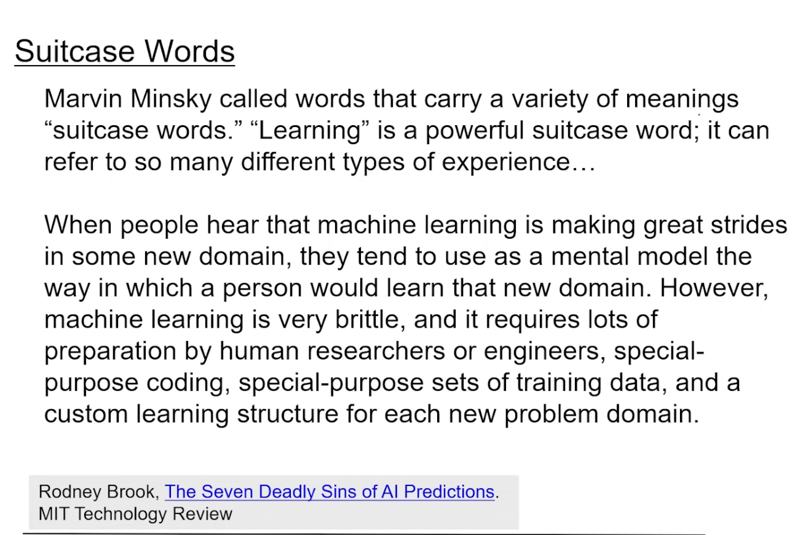
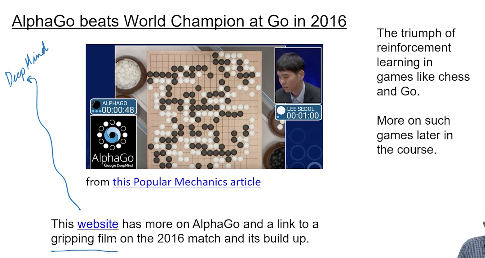
- https://docs.google.com/presentation/d/1WvKB9b-lGnQ-K5qNcjipg_WyHsefWnJe/edit#slide=id.p23
- deep mind Uk based company
- 2018 deep mind published a paper in nature, where they showed that they can predict the 3d structure of a protein from its amino acid sequence
- alphago0 - deep mind, 2017, beat the world champion in the game of go
- alphazero , can learn chess, shogi, go, without any human knowledge