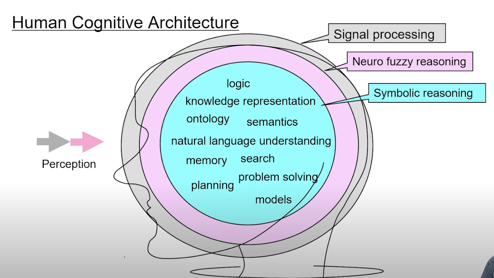
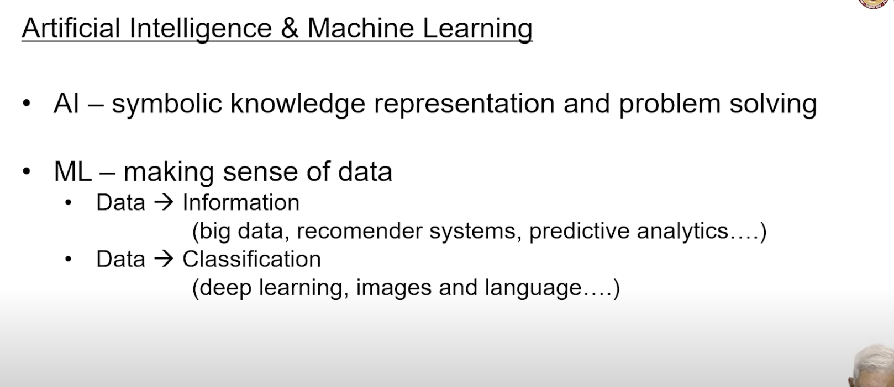
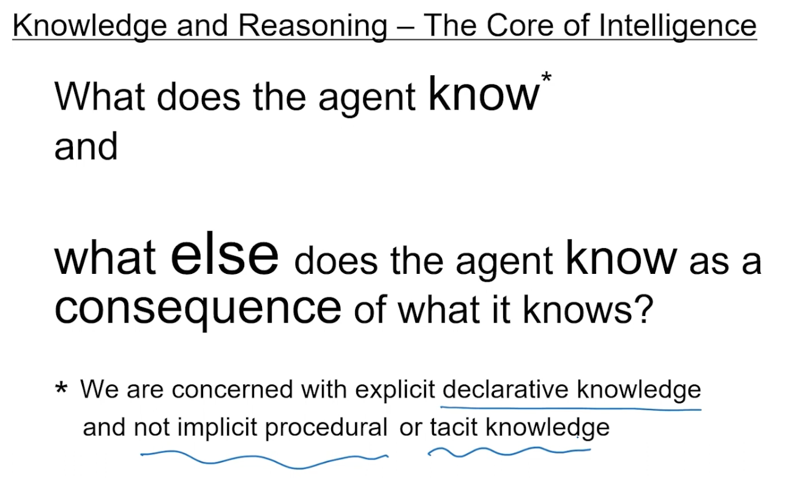
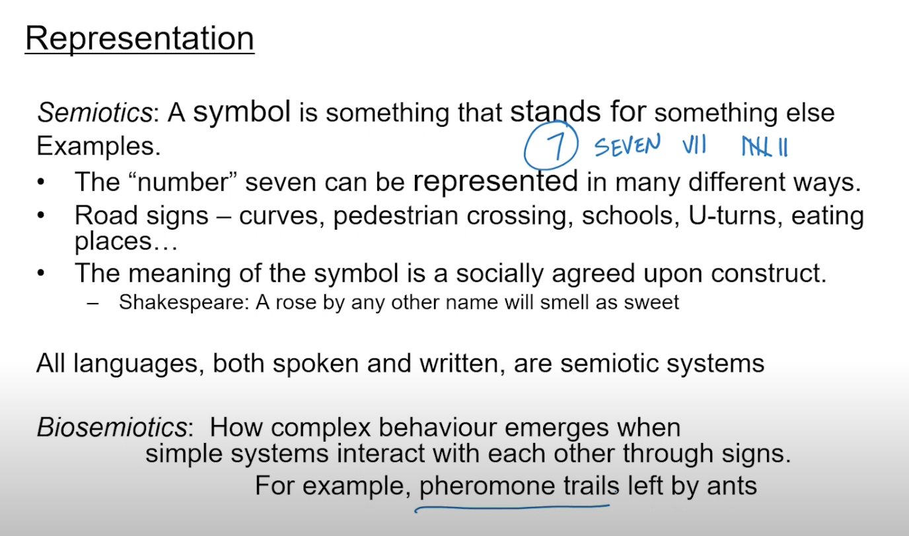
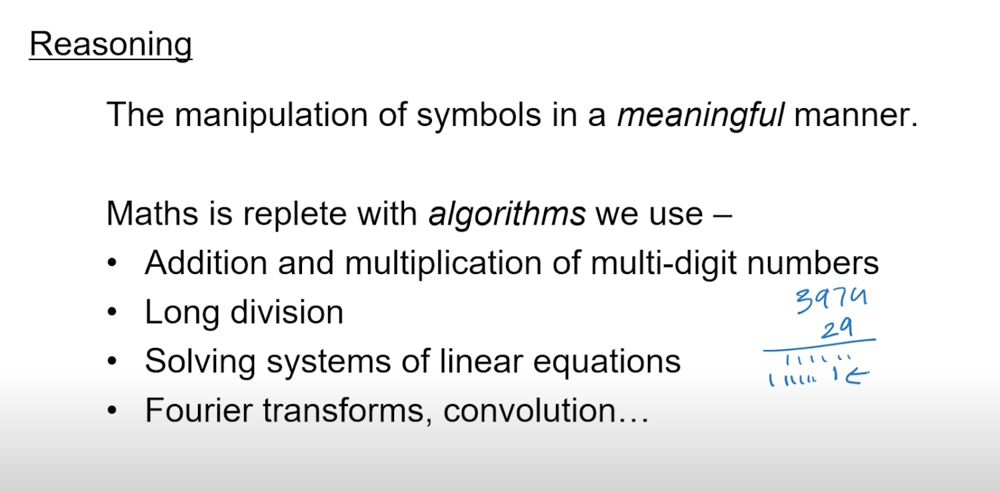
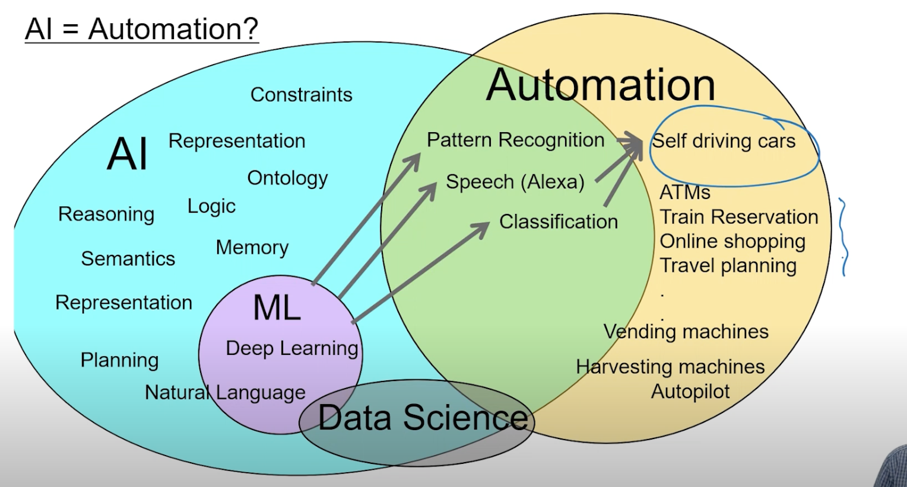

### Human Cognitive Architecture
- 

- ant colony optimization
    - in the ant colony, there are ants which are foraging for food, and they are going in different directions, and they are leaving a pheromone trail, and the other ants are following the pheromone trail, and they are also leaving a pheromone trail, and the other ants are following that pheromone trail, and this is how they are finding the food
    - this is a very simple algorithm, but it is very effective
    - this is a very good example of emergent behaviour
    - the ants are not intelligent, but the colony is intelligent
    - the colony is able to find the food, but the individual ants are not able to find the food
    - this is an example of swarm intelligence
- 
