## History and Philosophy
https://docs.google.com/presentation/d/1WvKB9b-lGnQ-K5qNcjipg_WyHsefWnJe/edit#slide=id.p31
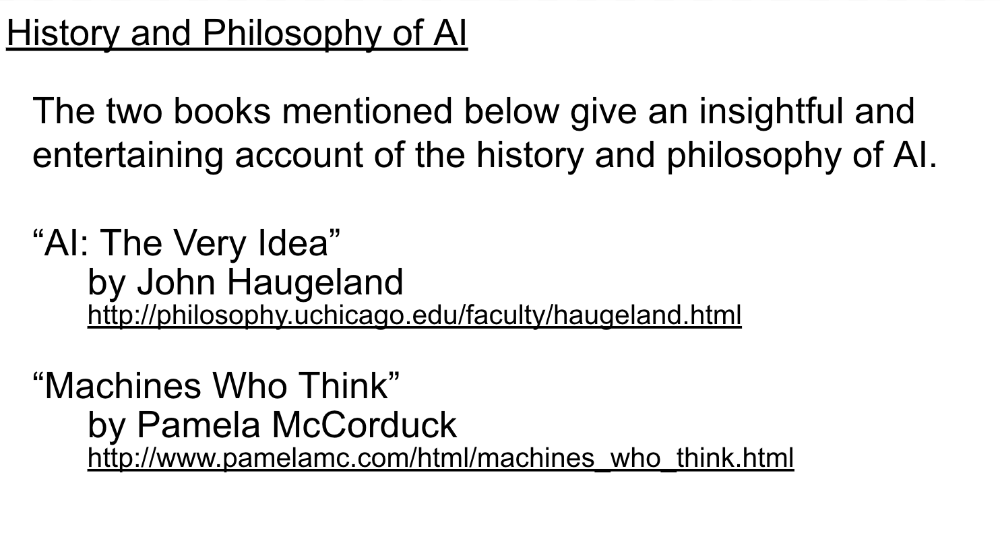
- books on history and philosophy of AI
- 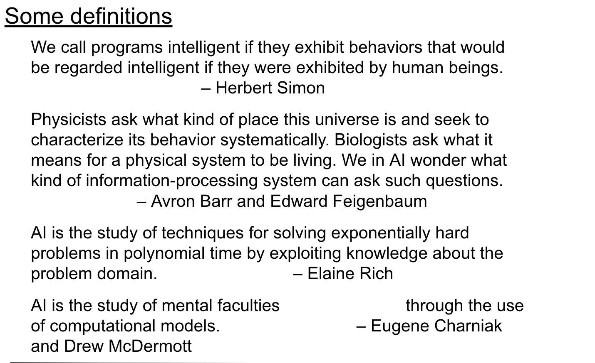
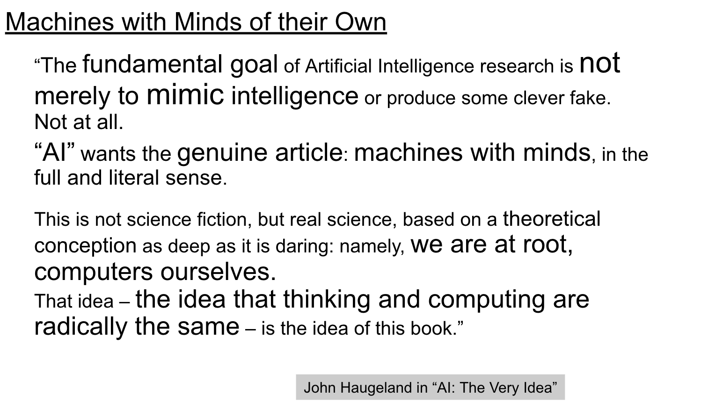
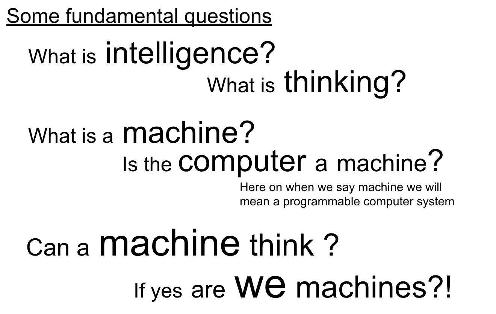
- some ppl say ability to use language, reason, solve problems, etc
- What is machine?(circular definition)
    - something that operates mechanically(machine)
    - operates by set of rule in a repeatable fashion
- is computer a machine?
    - yes, it is a machine, it operates mechanically, and it operates by a set of rules in a repeatable fashion.Behaviour is predictable    
- can machine think?
    - if yes are we machines?
- an AI should, 
    - tell the similarity between two different situations
    - tell the difference between two similar situations

- 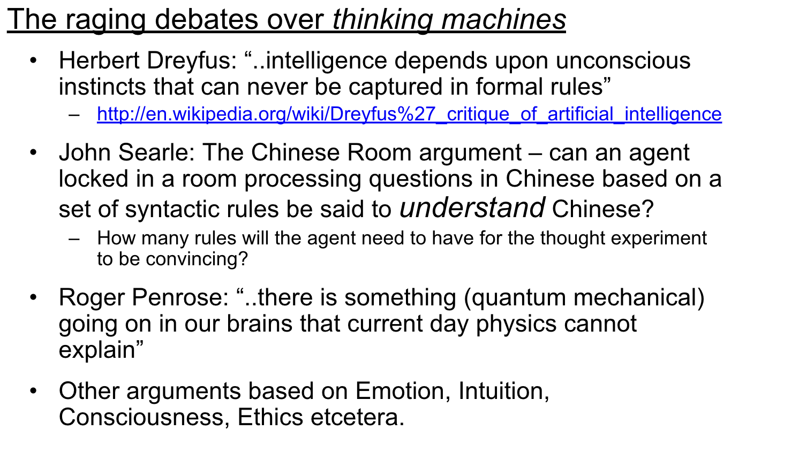
- https://en.wikipedia.org/wiki/Hubert_Dreyfus%27s_views_on_artificial_intelligence
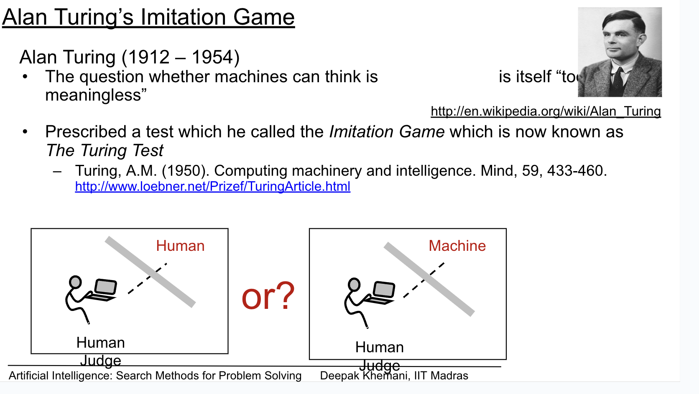
- http://en.wikipedia.org/wiki/Alan_Turing
- http://www.loebner.net/Prizef/TuringArticle.html
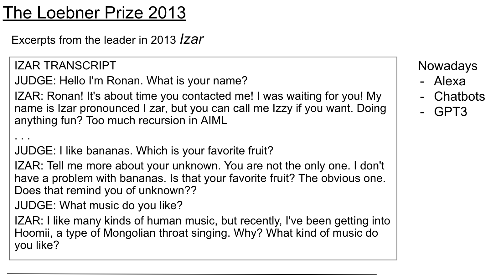
- 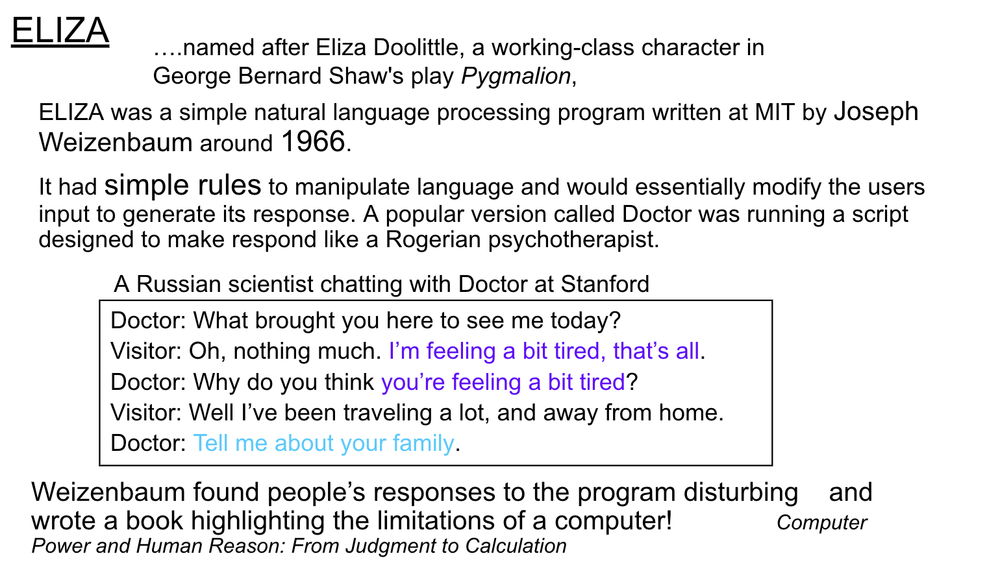
- pygmalion - myfairlady
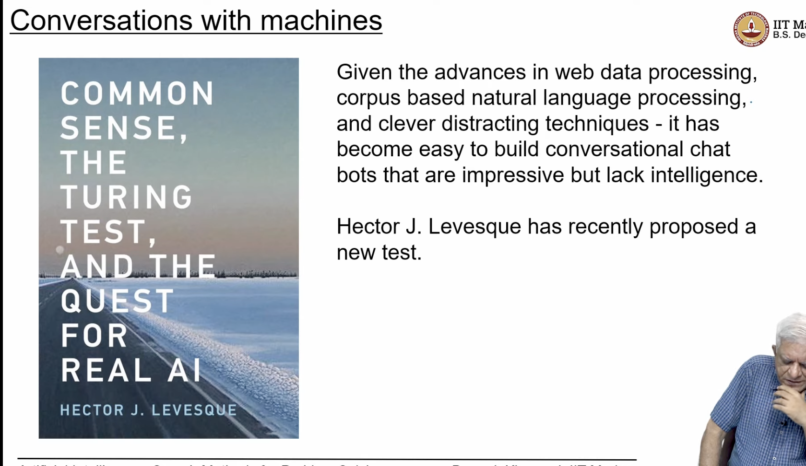
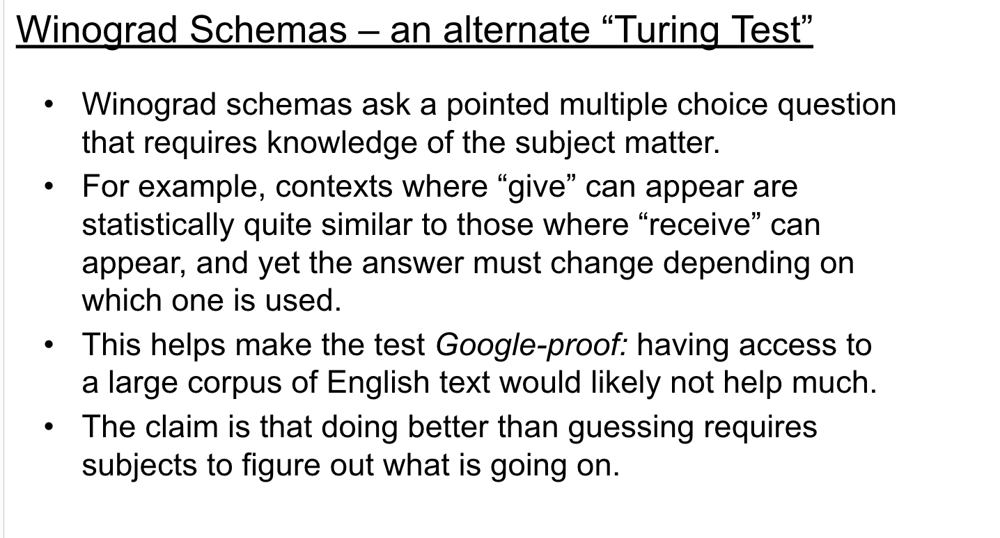
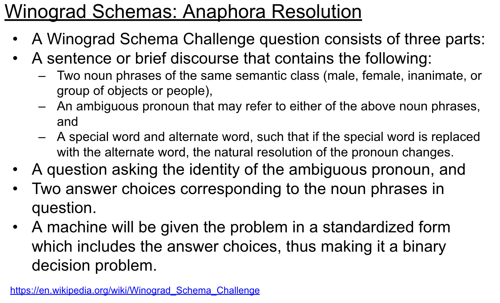
https://en.wikipedia.org/wiki/Winograd_Schema_Challenge
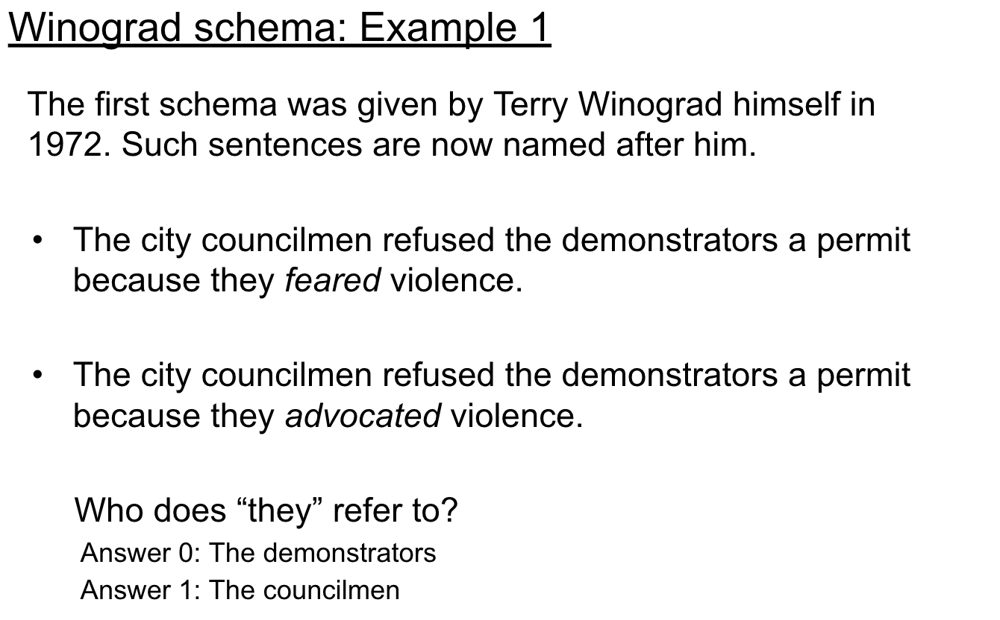
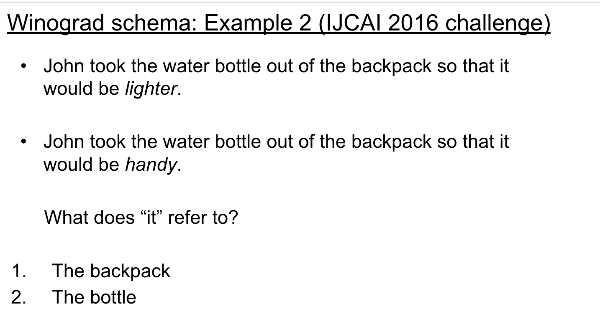
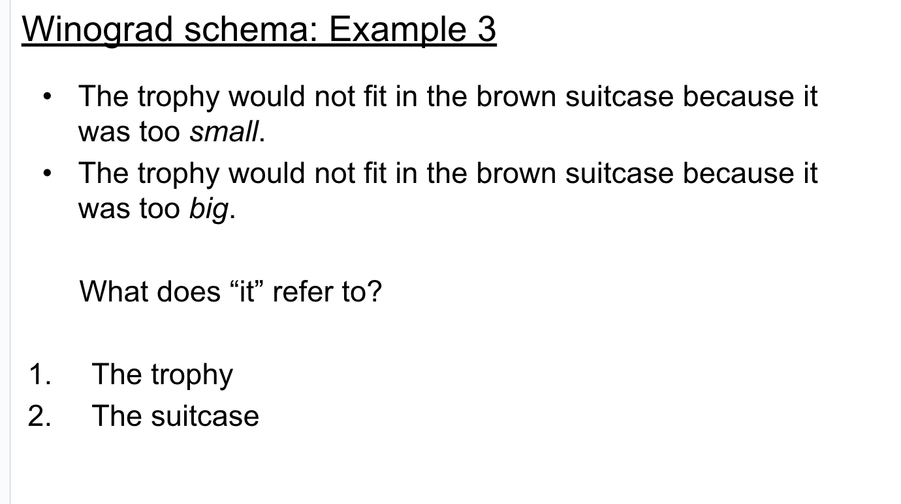
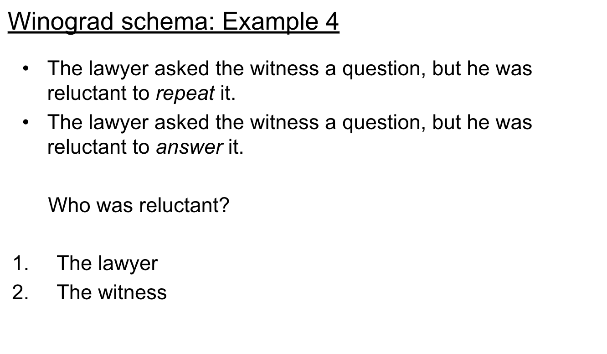