## State Space Search

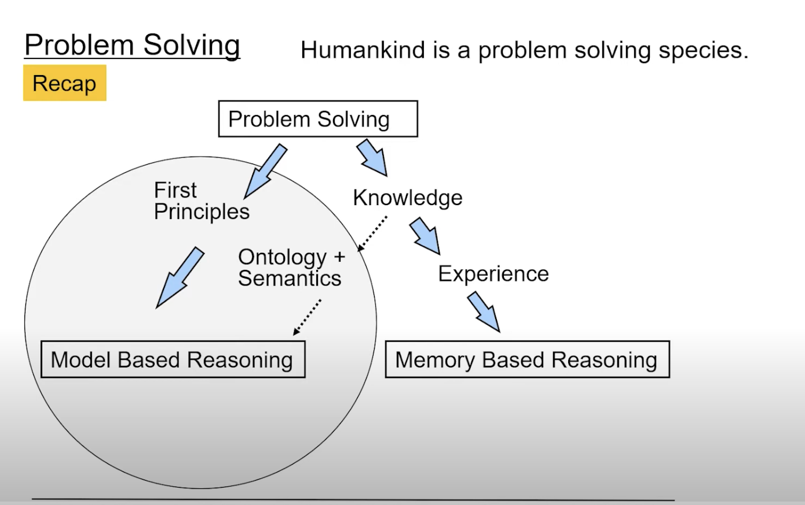
- recap , first principles , model based reasoning, and search methods
- 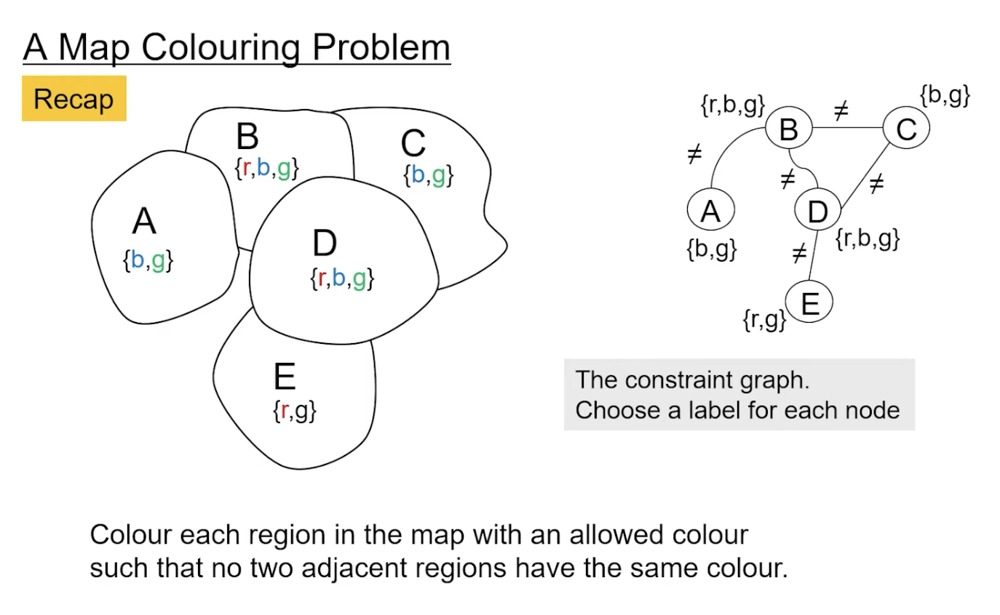
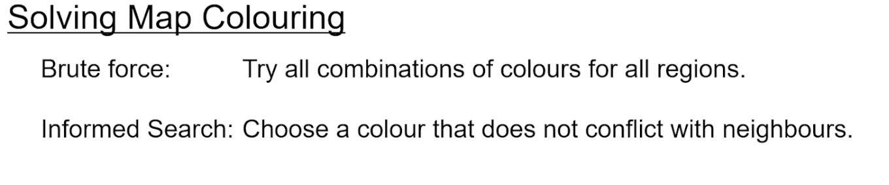
- choose the region that has fewest options first and then color that region
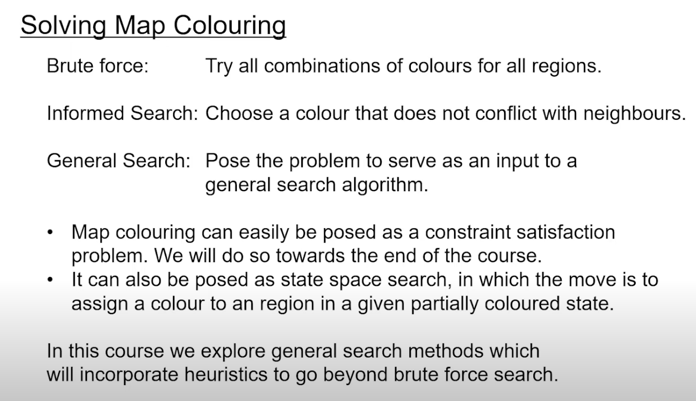
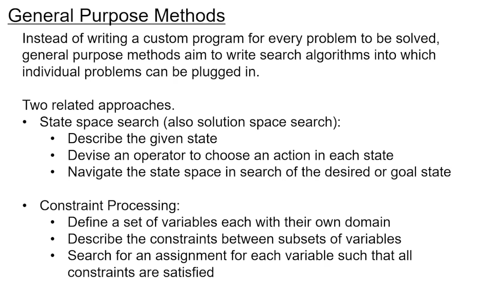
- Constraint Processing, (subsume state space search)   
    - define set of variables
    - describe constraints between subsets of variables 
        - eg countries which are adjacent to each other cannot have the same color
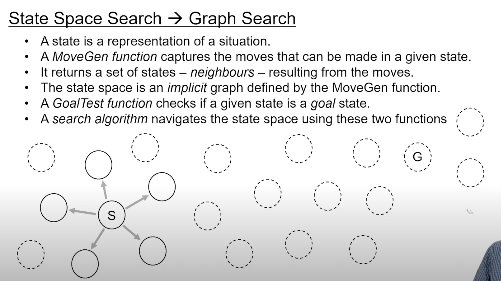
## Some samlple problems
- 
    - map coloring
    - sudoku
    - rubiks cube
    - The water jug problem
        - 3 jugs (8,5,3) litres
    - 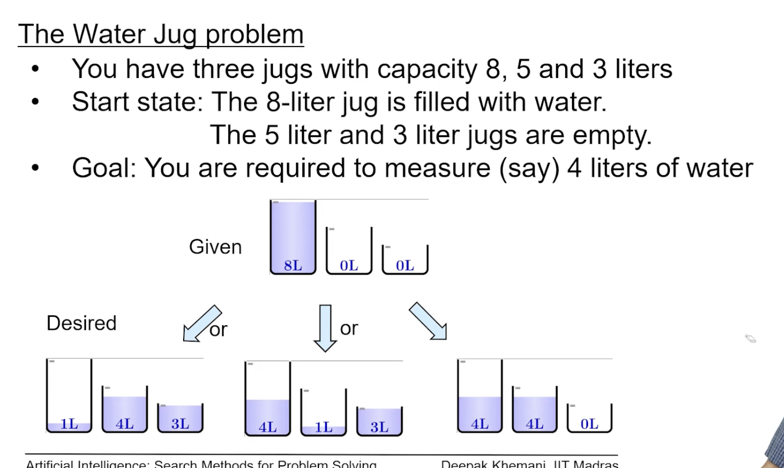
    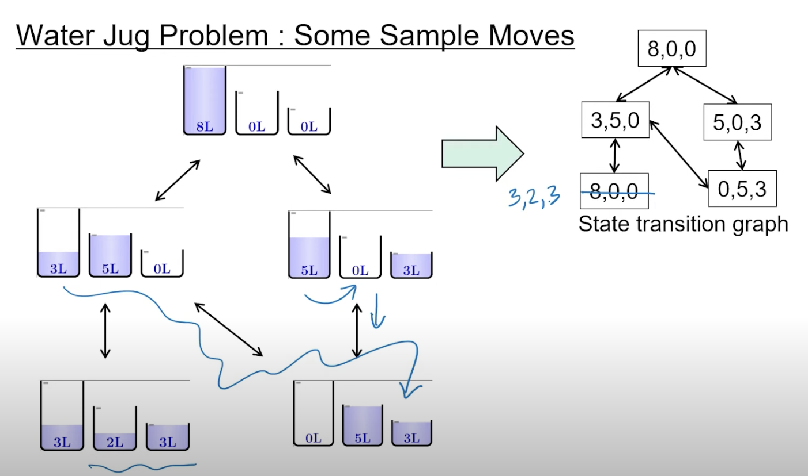
    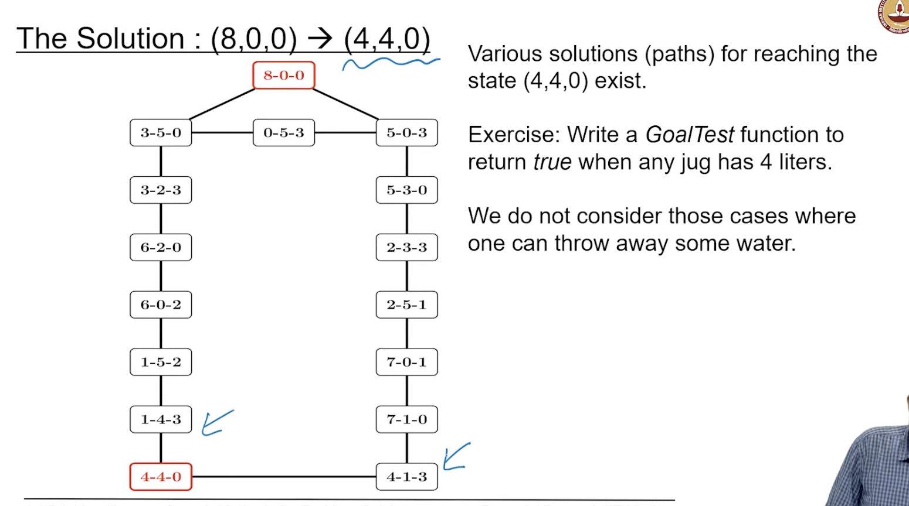    
    - reversible moves are thick lines, the light lines are non reversible
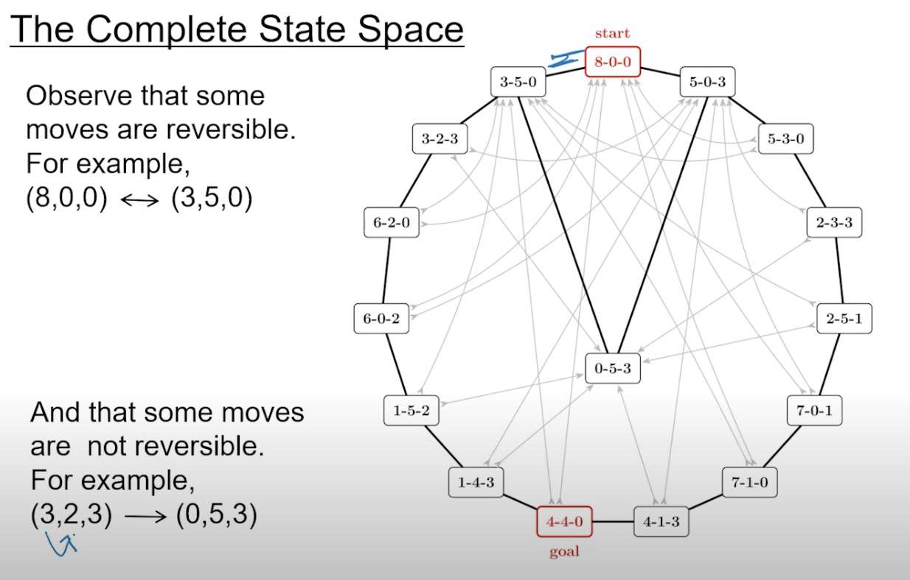
- 8 puzzle -> simpler version of rubik's cube in 2d
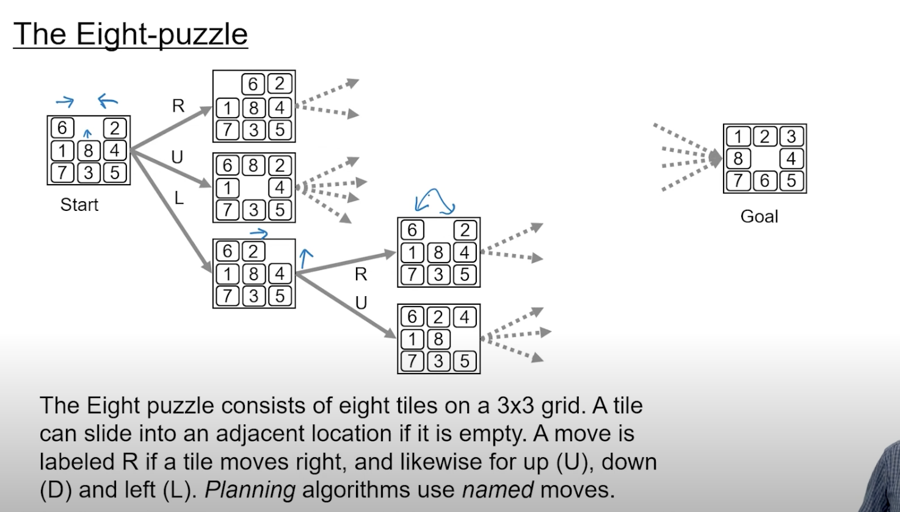
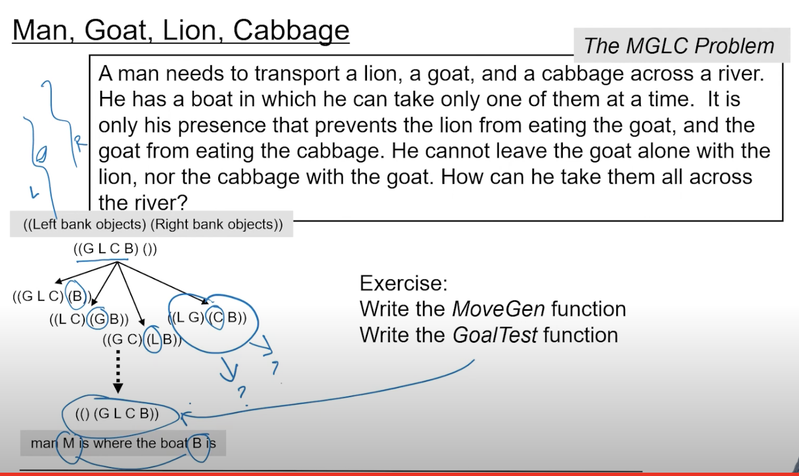