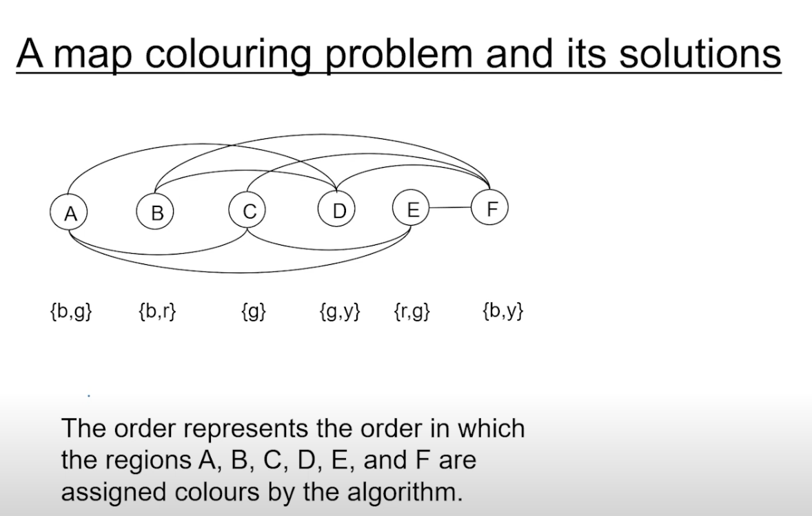

## State Space Search

- recap , first principles , model based reasoning, and search methods
- 

- choose the region that has fewest options first and then color that region

- Constraint Processing, (subsume state space search)   
    - define set of variables
    - describe constraints between subsets of variables 
        - eg countries which are adjacent to each other cannot have the same color

## Some samlple problems
- 
    - map coloring
    - sudoku
    - rubiks cube
    - The water jug problem
        - 3 jugs (8,5,3) litres
    - 
    
        
    - reversible moves are thick lines, the light lines are non reversible

- 8 puzzle -> simpler version of rubik's cube in 2d

- LG is not a good state, as lion and goat cannot be kept together
- GC is also same

- objects on the side where the boat is
- start by telling where boat is 
- here man = boat(right or left)

- here edges represent adjacent countries
- the order is A,B,C...

- solution is the above
- Traveling Salesman - Holy grail of CS
    - order of factorial of N
        - N - no of cities

- figure shows two possible tours
- what is travelling sales man problem?
    - A salesman has to visit a set of cities and return to the starting city, visiting each city exactly once, and minimizing the total distance travelled
- from the picture , the tour on the right looks more optimal
- we will look at it in more detail later, as its an optimization problem and not satisfiability problem
- eg of satisfiability problem is sudoku, where we have to find a solution that satisfies all the constraints 
    - other eg is map coloring
    - other eg is 8 puzzle
    - other eg is water jug problem
    - all the above are satisfiability problems
- a maze is a classic example of a search
- enter and exit are the start and goal states

- we can represent a maze by graph aswell,
- each node is a choice point
- it illustrates an interesting feature of search, we have bird eye view of the maze, but we dont know the details of the maze, this benefit is not availble to the agent

