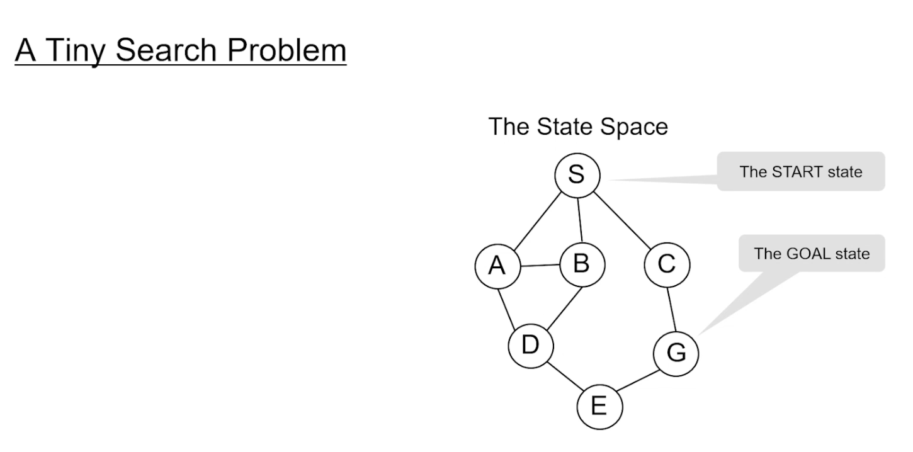

## General Search Algorithms

- we want to do domain independent problem solving algorithms

- the task is to develop those algos

- we want to reach the goal state from the start state
- the state space search is implicit, the graph is not given to us,we have to generate the graph on the fly using the movegen function
- we are only given start and the goal state, sometimes, only the start state and the goal description, eg, Water jug problem
    - we had three , different goal states in which we can measure goal states


- goal test is to check if the current state is the goal state or not 


    - purple - open,
    - dark - closed




- Here is our simple search algo
    - we start by adding S to open
```
Open= {S}
while open:
    N=open[0]
    open.remove(N) 
    if goaltest(N)==True:
        return N
    else:
        # we call the move gen function to generate the children of N, and add those to open
        open=movegen(N,open) 
return Failure
```

- we do this if we get goal ,or if open has no more nodes by returning failure

- in search tree it is possible to have cycles, but in search graph, we cannot have cycles


```
Open= {S}
Closed={}
while open:
    N=open[0]
    open.remove(N) 
    closed.add(N)
    if goaltest(N)==True:
        return N
    else:
        # we call the move gen function to generate the children of N, and add those to open
        open=movegen(N,open) - closed
return Failure
```
- the search space is smaller than the previous one

- here if we can see there is D,B,C that is left in white , as they are already in closed,
- we shall see later if ther is any hidden cost.
- 
https://youtu.be/nxeoZkr0k6U?t=862
- we will only add new nodes, 
- start with s,  add A,B,C to open
- we will not add B to child of A, 
    - because S is already in closed
    - A has 3 children (SBD)
    - B is already in open , so we will not add it
    - so we will go with D
     

- this algo says only if you can reach the goal, it wont give you the path
