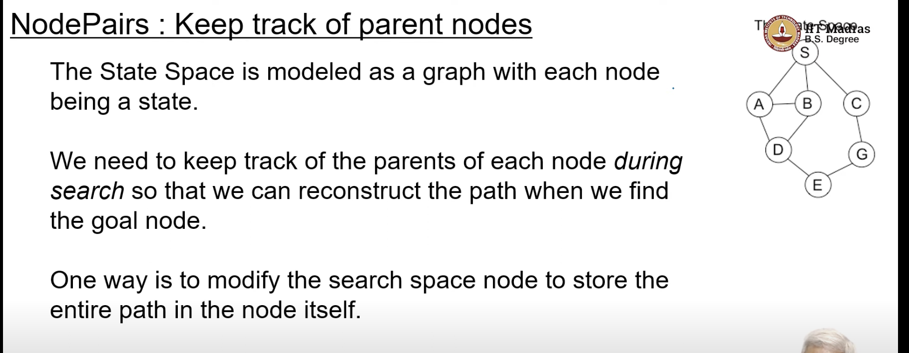
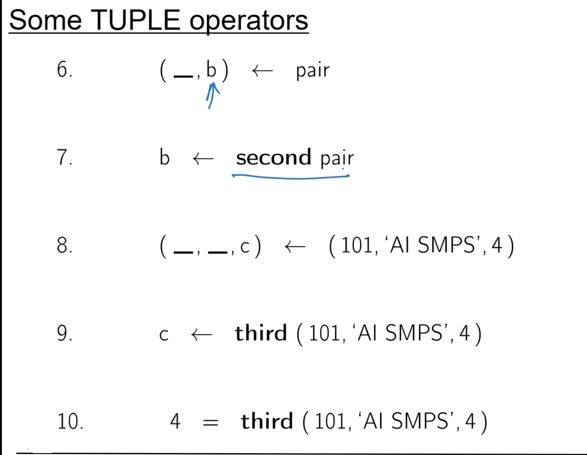

 ## Planning Problems, Configuration Problems

 - There are two kinds of problems,that we can solve using our state space search
    - Planning Problems
        - 
    - Configuration Problems
        - a state satisfying a description of the goal is solved
        - eg : N-queens problem(give me a configuration of queens on a chess board such that no queen can attack any other queen)
        - SAT - satisfiability problem, given a boolean expression, find an assignment of true and false to the variables in the expression such that the expression evaluates to true
        - Hamiltonian path problem, given a graph, find a path that visits every node exactly once
        - 

- 
    - state space is on the right
    - the search space is generated on the fly
    

- parent of D is A

- so far we did , non deterministic method(pick some node N from open)
    - non deterministic means ,we dont specify which node to pick 
- Not non-deterministic means somehow the algo knows what is the correct choice
    - for eg , when we study non-deterministic finite automata, we assume that there is an oracle which know which is the right choice

- we used set so for, now we shall use list

- : here means , add an element to the head of the list 

- this means we started with list1, we added a new element to the head of the list, to arrive at list2, its like assignment operator

- these are equivalent
- 
https://youtu.be/fTPrAci0WWA?t=653
- basically he is saying tail[1]=[]

- tail is basically, everything except head

- `:` operation is specifically used to add an element to a list
- `++` - take two lists and add them together, 
- 
    - here this treats the first argument as an element
- 
- 
    - the `_` means we dont care about the second element
- we can access the first element of the tuple using  a function called first
- 
    - 8th point says we can have any datatype
    - 9th point is an assignment
    - 10th point is a test, it will return true or false
- 

- here there are three elements in the tuple,
- (a,head:tail,c)