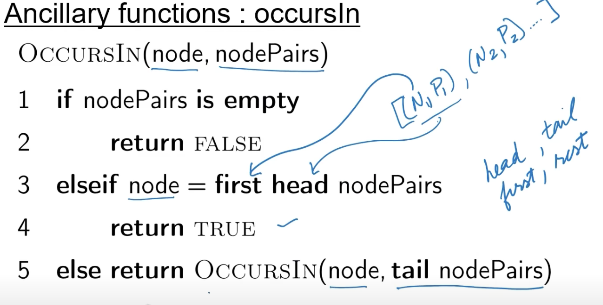

## Blind Search


1) we create add (s,null) to an empty list and assign it to a variable OPEN
2) CLOSED=[]
4) head(OPEN) which will be the tuple (s,null)
5) (N,_) -> means we assign N to the first element
```
if call_goal_test(N):
        return REconstruct_path(nodepair,Closed)
else
    we added nodepair to closed(concatenate)
    children=movegen(N)
    new_nodes=removeseen(children,OPEN,CLOSED)
    #new nodes are the nodes that we generated which are not present in open or closed
    newPAIRS=makepairs(newnodes,N)
    # takes each of the new nodes and assign N as the parent to them
    open=newpairs ++ tail(open)
    # we appended it at the beginning of the open , thus forming a stack data structure
return  empty list
```

- RemoveSeen(nodelist,open,close)
    - nodelist is set of neighbours that was returned to us by movegen function
    - from that nodelist, we want to remove anything that is open and anything that is closed
- occursin() -> if a node is in open or close it returns true

- ## try writing a python code for the above

- 
    - nodepairs could be OPEN or CLOSE
    - nodepair = (NODE,PARENT)


https://youtu.be/yRKqKdp-9ns?t=574


- DFS is achieved by treating open as stack
- BFS used open as a Queue,(FIFO)
- BFS generates children, but wont look at the children immediately
- BFS travels the tree level by level
- DFS is impecuous (finds a  new node, goes to it)
- BFS is conservative,
