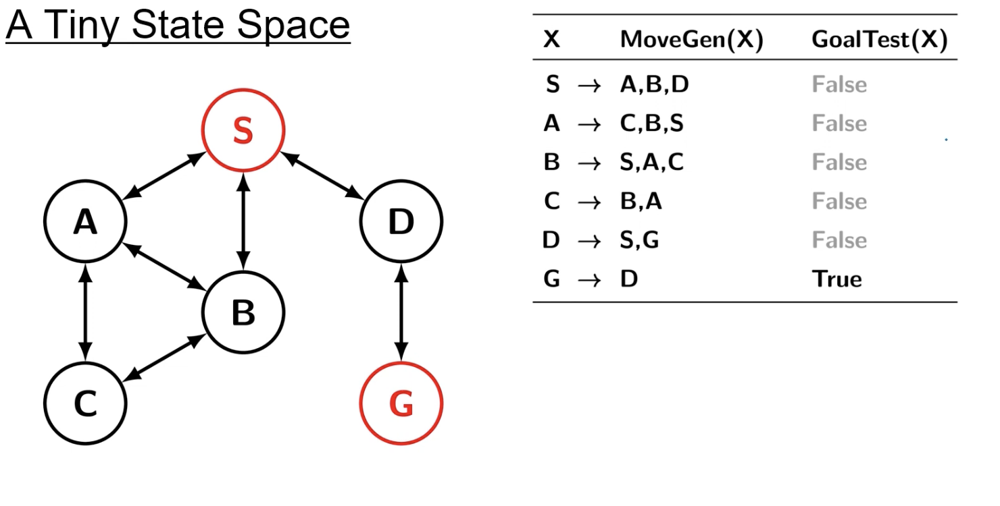
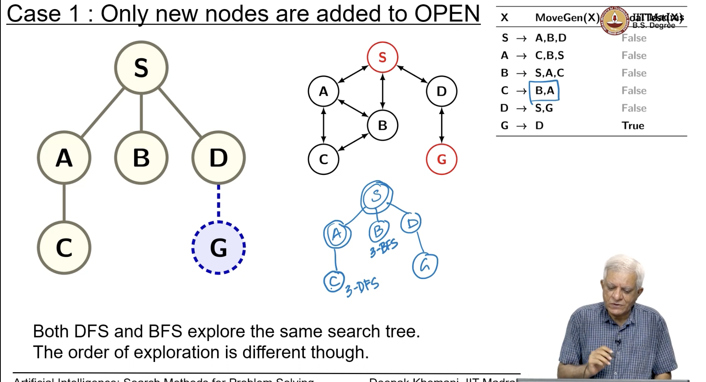
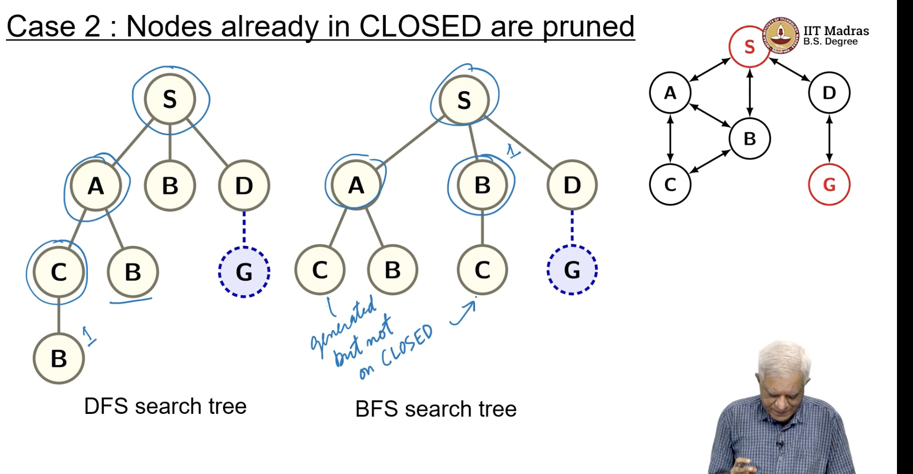
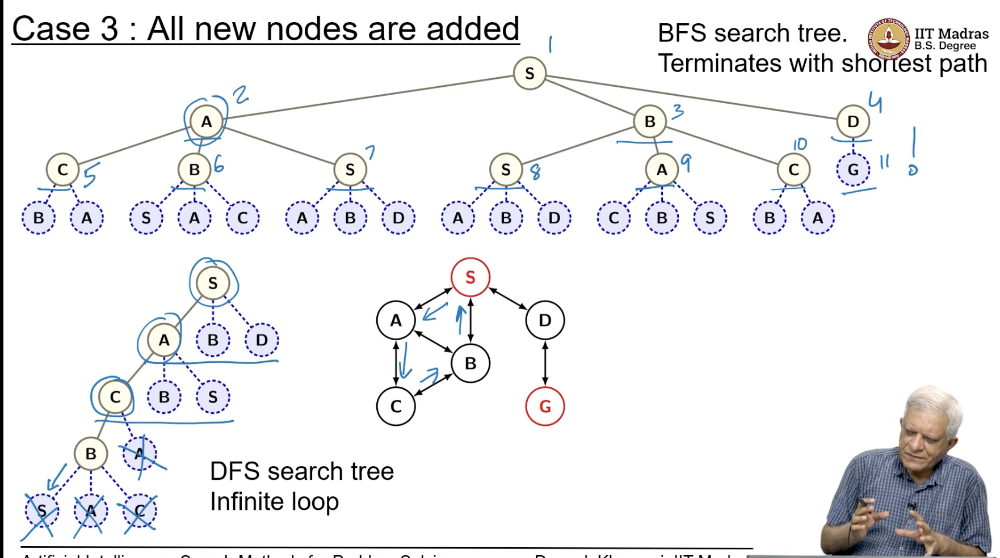

## A Tiny Example

- BFS is conservative, and it goes level by level
- DFS -> shortest path

- BFS is not impecuous like DFS, it does not dive into the search space, it says let me finish all the nodes generated, level by level, and it finds path to the goal node