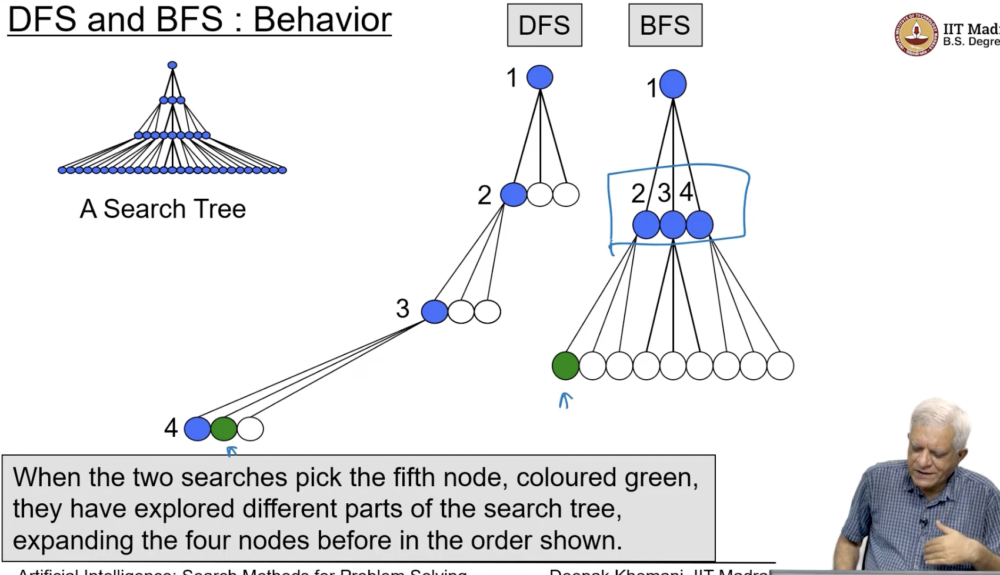
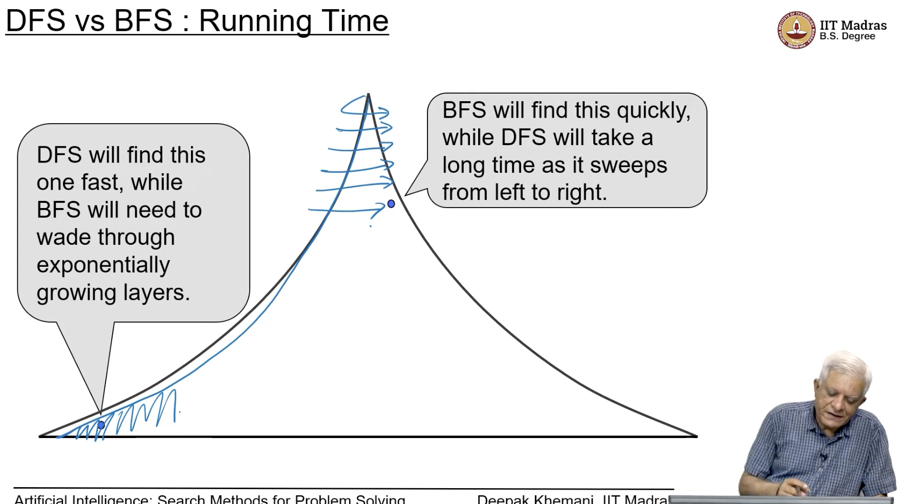
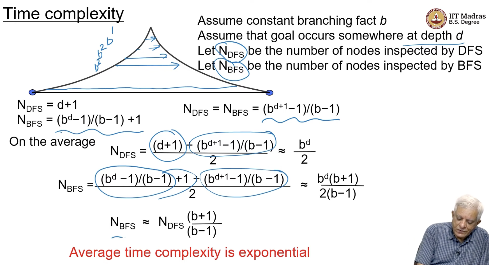
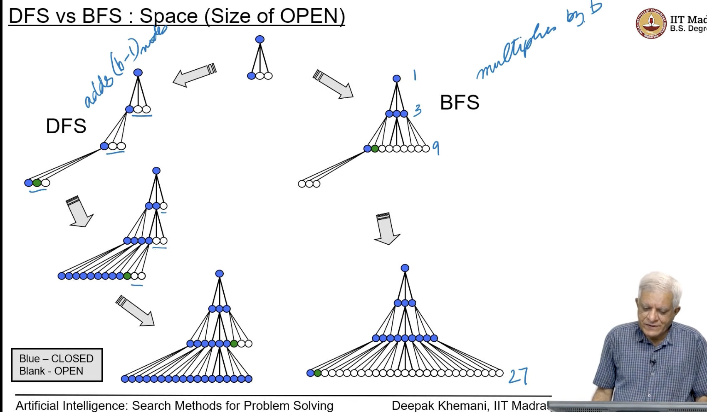
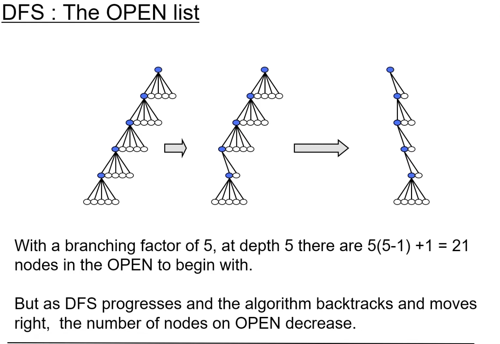
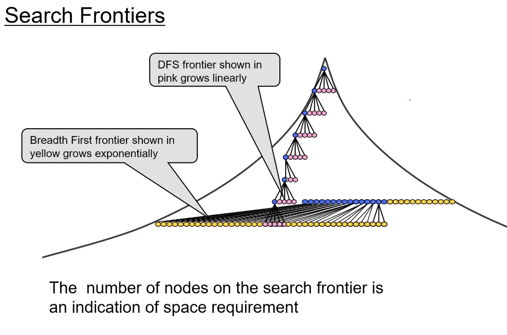
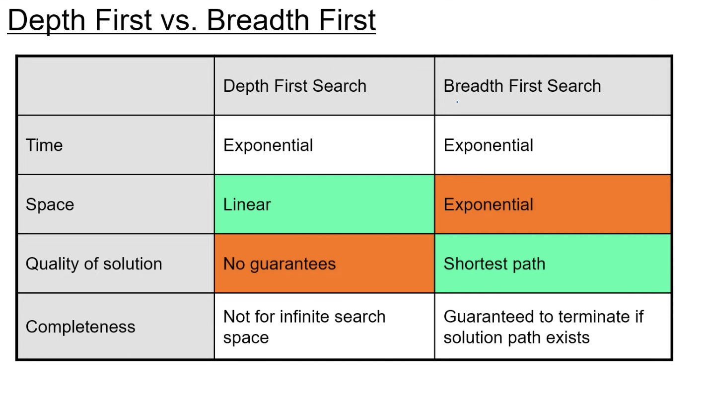
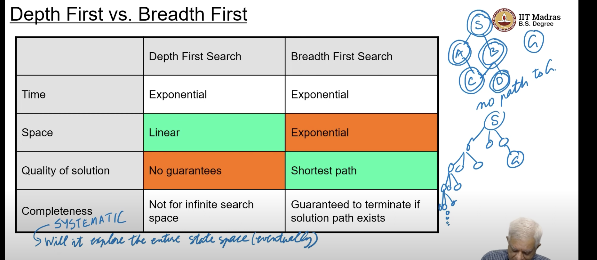

## Analysis of DFS and BFS
- DFS - treats open as a stack (LIFO)
- BFS - treats open as a queue (FIFO)

- we saw that BFS wont go into infinite loop

- if we look at the ratio, 
    - no of nodes inspected by BFS is more than that of DFS by a factor of (b+1)/(b-1),
    - b is bouncing factor, if b=10, then the ratio is 11/9 times more,
- Important thing is they are exponential in nature of complexity

- as for as the size of open is concerned, DFS is a good algo, the space required is only linear in nature, whereas BFS needs more space

- as the search sweeps from left to right, the size of open reduces for DFS, as we have finished

    - search frontier means the open nodes, they define the set of candidates that we want to inspect,
    - DFS - pink grows linearly 
    - BFS - exponentially , yellow

