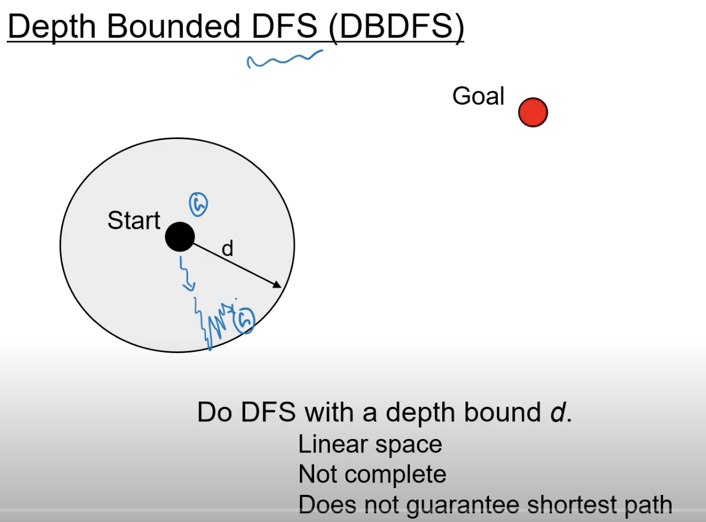
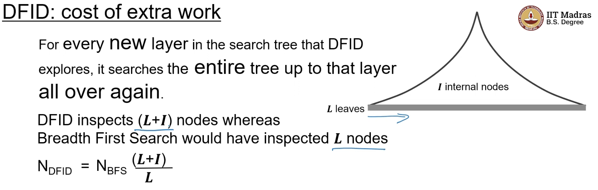

## Depth First Iterative Deepening

- we use heuristic search,

- we want to looks at an algo that uses both the good properties from both the algos,i.e
    - linear space for open
    - shortest path delivery

- we shall start by Depth bounded DFS(DBDFS)
    - it means we are guaranteeing linear space
    - lets say the bound is d

- not different from earlier DFS
- here instead of node pair, we have a node triple

- it increasingly looks at  , increasing depth bounds
- we initialize count to -1
- iteratively increase the depth bound,

https://youtu.be/QuG7ooEPOFI?t=748

- 
- because D is already in closed, DFID will miss finding the shortest path

- chess players think 6 moves ahead or 8 moves ahead. 
- this is called ply
- instead of keeping this depth constant, we can increase it by 1   
- DFID enable any time move generations, in games like chess

- is there a catch?
    - what is the extra cost?

- this is the number of leaves in the full tree, 
- extra work , ratio is 

    

- this is not a good strategy

- the three algos are blind or uninformed search
    - BFS
    - DFS
    - DFID
- blind means, when we are searching, we are not using any information about the goal, we are not aware where the goal is hence called uninformed
- A good search Algo should have some sense of direction, it should be informed, it should use some information about the goal
    - its should have some sense of direction, it should realize that it is going in the wrong direction, and it should change direction

## heuristic search- NEXT