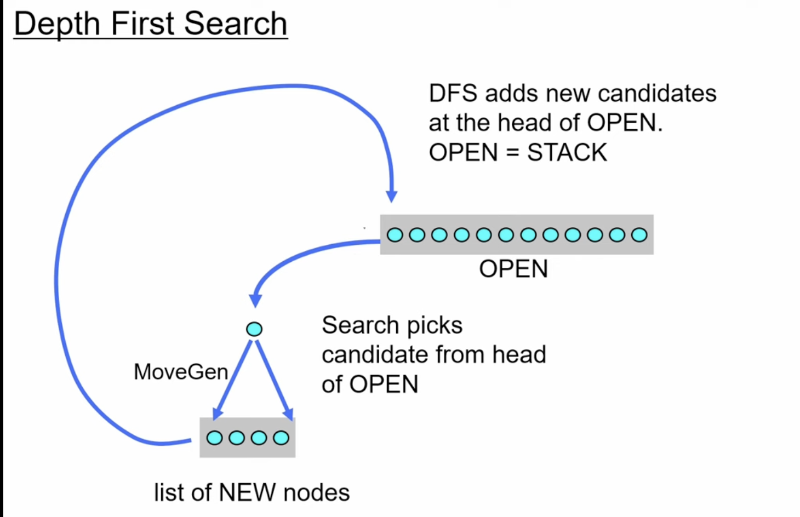
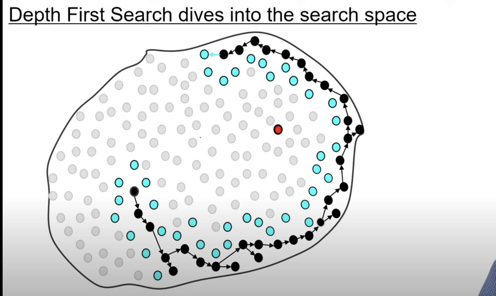
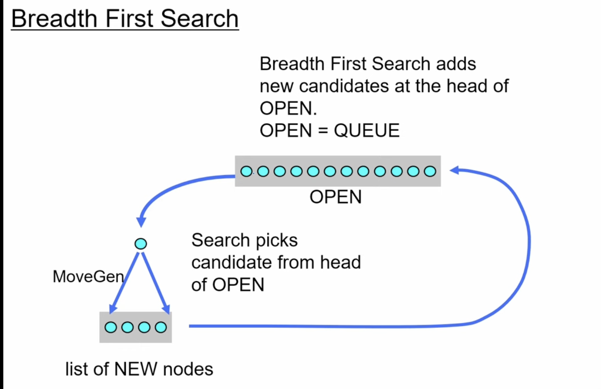
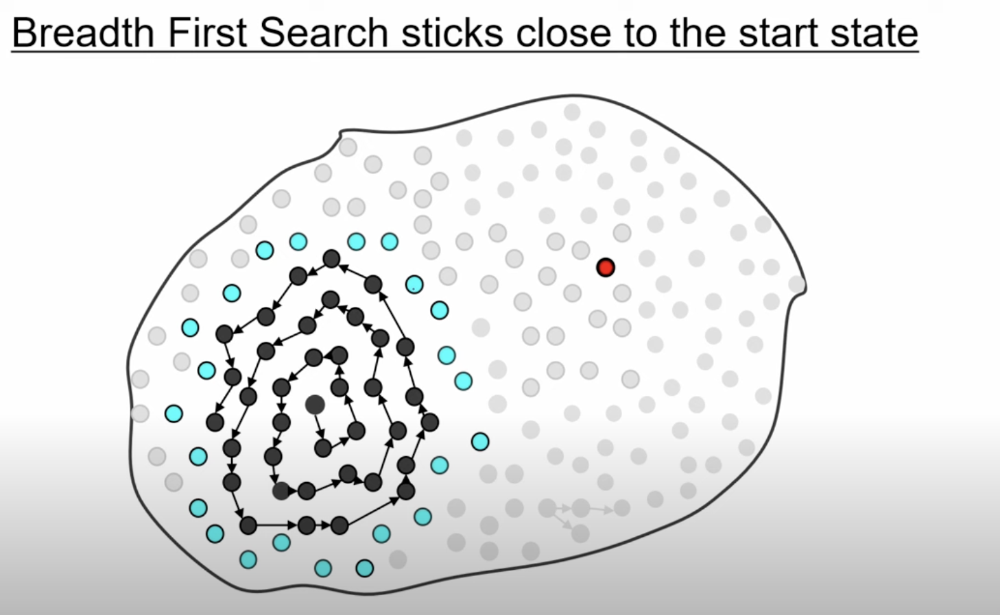
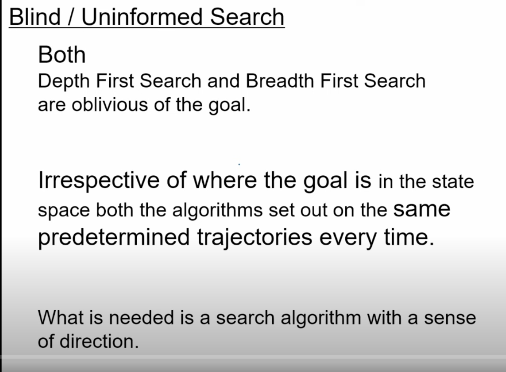
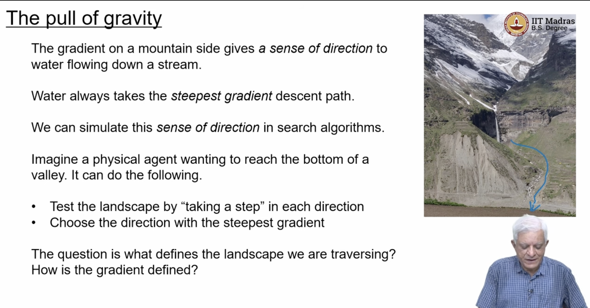
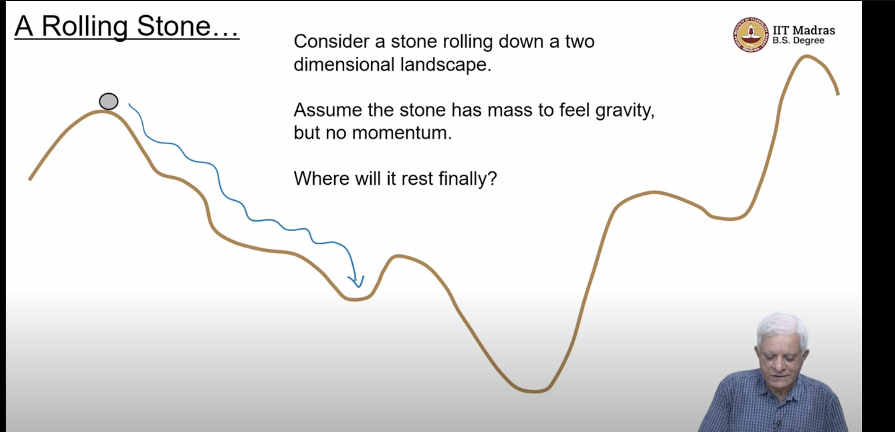
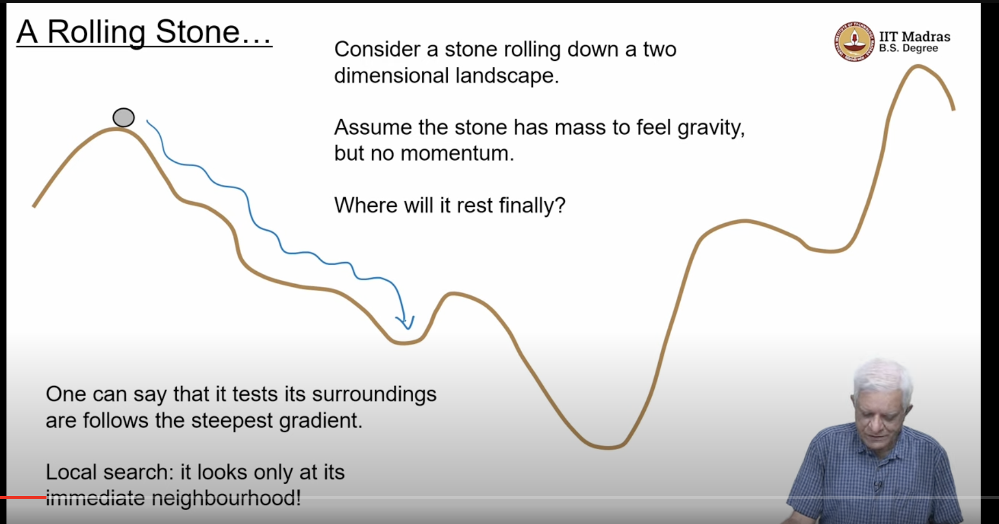
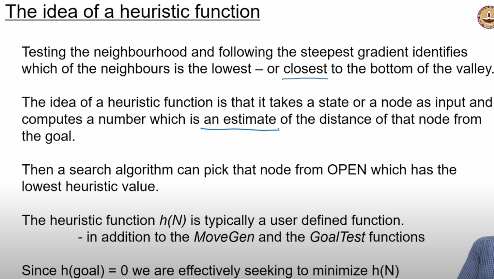
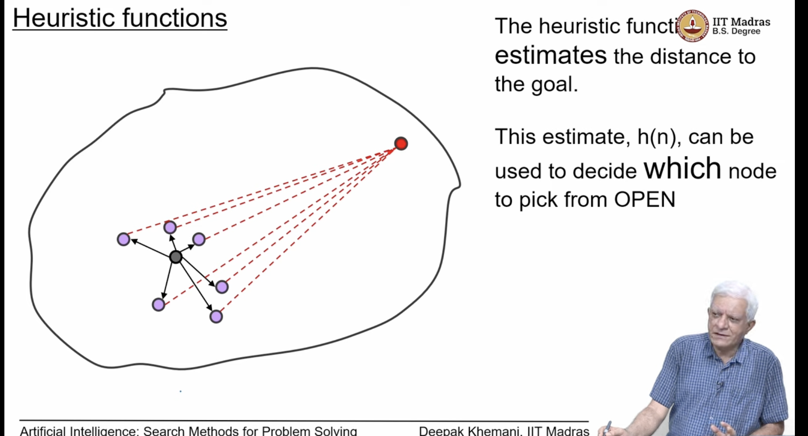

## L3.1: Heuristic Search

- DFS and BSF are called blind search or uninformed search as they do not use any information about the goal
- they dont have any sense of direction
- Heuristic search
    - it has  sense of direction
    - 
    - approach for DFS,
        - we always extract a node from the head of open , and check if it is goal or not, if its not a goal then we call the movegen function 
    - 
        - the red node is the goal node and we can see that it is not giving any attention to the goal node
    - 
    - other algo was BFS, in which the new nodes are added to the tail of open, making it behave like a queue, 
    - 
    - because of that it lies closer to the source as possible
    - this will always finds the shortest path whenever it finds a path
    - these algos are called blind or uninformed search
        - both dfs and bfs are blind search
    - 
    - it should someway be aware of which direction to go
    - 
    - 
    - if no momentum , then the ball will stop at the bottom of the hill, 
    - where all gradients are pointing upwards and there are no gradient pointing downwards
    - 
    - the idea of a heuristic function 
    - closeness to the goal is what we are trying to capture
    - there are there funcitons that a user is expected to provide to a general purpose search algorithm
    - movegen - navigates the space
    - goaltest - checks if a node is a goal node, and stops the search
    - heuristic - it is a function that takes a node as input and returns a number, which is an estimate of how close the node is to the goal
        - it estimates the distance to the goal
    - 
    - 
- Best First Search
    - open the best node on the open list