L4.1: Iterated Hill Climbing

- we have been looking at means to escape local optima, when doing local search 
- we saw two deterministic ways to do that
    - beam search
      - beam search is a way to escape local optima, by keeping track of k best solutions at each iteration, and then choosing the best one among them, and then continuing the search, 
      - this way we can escape local optima, but we can also get stuck in a local optima, if the best solution is not the optimal solution, and we are not able to escape it
      - so we need some other way to escape local optima, 
    - variable neighbourhood descent
      - in variable neighbourhood descent, we have a set of neighbourhoods, 
      - and we start with a neighbourhood, and then we do local search in that neighbourhood, and then we move to the next neighbourhood, and then we do local search in that neighbourhood, and then we move to the next neighbourhood, and so on, 
      - and we keep doing this, until we reach a neighbourhood, where we are not able to improve the solution, and then we stop, 
      - so this way we can escape local optima, but we can also get stuck in a local optima, if the best solution is not the optimal solution, and we are not able to escape it
      - so we need some other way to escape local optima, 
      - and we will look at one such way in this lecture , which is called iterated hill climbing,
- tabu search was the third one we saw to escape local optima, but it was a stochastic method, and we will look at stochastic methods in the next lecture,
  - in tabu search, we keep track of the moves we have made, and we make sure that we do not repeat the same move again, 
  - so tabu search is a way to escape local optima, by keeping track of the moves we have made, and then making sure that we do not repeat the same move again, 
- in practice we use randomised methods of stochastic methods
  - because they are more effective, and they are more efficient,
  - and we will look at stochastic methods in the next lecture,
- lets look at some of them
  - simulated annealing
  - genetic algorithms
  - ant colony optimisation
  - particle swarm optimisation
  - and so on

- Why are we interested in local search?
  - because the search space is too large
  - 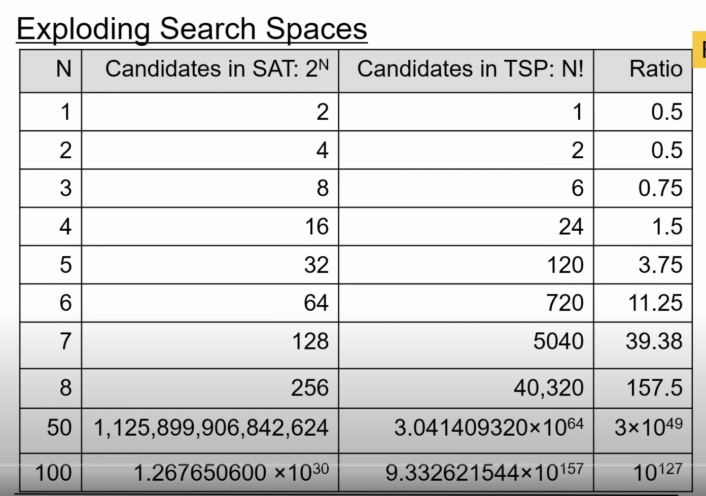
  - once the size of n becomes above 50 , then size of search space will be too huge to explore completely,
  - so we need some kind of approach to search through a solution but in a local manner
  
- ## the SAT problem (satisfiable)
  - is the given boolean or Propositional formula satisfiable?
  - proportional logics where we have statements like
    - p and q
    - p or q
    - p implies q
    - p is true
    - q is false
  - and we have to find out if the given formula is satisfiable or not  
    - example 
      - (a or b) and (not a or c) and (not b or c) and (not c or d) and (not d or e) and (not e or a)
        - this is satisfiable, because we can assign values to a,b,c,d,e such that the formula is true
        - for example, if we assign a = true, b = false, c = true, d = false, e = true, then the formula is true
      - (a or b) and (not a or c) and (not b or c) and (not c or d) and (not d or e) and (not e or a) and (not a or not b) and (not b or not c) and (not c or not d) and (not d or not e) and (not e or not a)
      - this is not satisfiable, because we cannot assign values to a,b,c,d,e such that the formula is true
      - so we have to find out if the given formula is satisfiable or not
  - we can represent the above formula as a graph
     - refer to the image in the link below

  - boolean values where we have variables like a,b,c,d,e or x,y,z and so on
  - 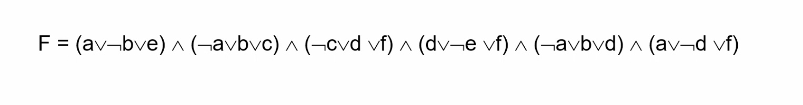
  - the above formula is called conjunctive normal form
  - we have a set of clauses, and each clause is a disjunction of literals
    - clause is - (a or b), the brackets are not part of the clause, the clause is just a or b
    - the data in the brackets is called a literal
  - what is the semantics of this formula in the CNF form?
    - every clause must be satisfied
    - by satisfied we mean, that every clause in the above image should be true, as it is an and of all the clauses
  - in the above image there are 6 variables, and they can take 2 values each (0,1 (or) True or False), so there are 2^6 = 64 possible assignments
    - 1 - True
    - 0 - False
  - the task is to look for an evaluation for these 6 variables, such that the formula is true
  - for the above image with 6 boolean clauses, we have to make each of these clauses true, as its an and of all the clauses
  - Also note that if we can see inside each clause , we have a disjunction of literals, and we have to make each of these disjunctions true
  - and there is `or` condition in all of these clauses, so we have to make sure that atleast one of the literals is true
  - the different combinations of 0's and 1's are called candidates

- ## Complexity of SAT
  - 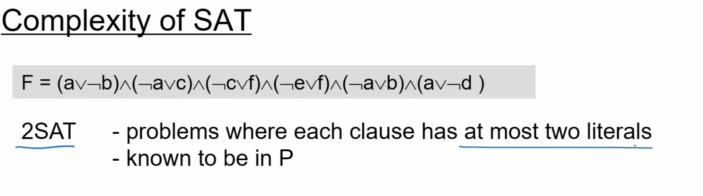 
  - 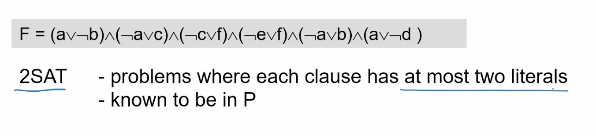
  - solving 2 sat's is easy and it can be solved in polynomial time
  - 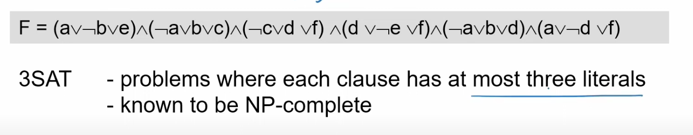
  - 3SAT is NP complete
    - it means non deterministic polynomial time to solve
    - if we somehow had an oracle that could solve 3SAT in polynomial time, then we could solve all the NP problems in polynomial time
    - but otherwise, it would take exponential time to solve 3SAT
    - NP complete means that if we can solve 3SAT in polynomial time, then we can solve all the NP problems in polynomial time
  - This is why SAT is a very important problem
    - because if we can solve SAT in polynomial time, then we can solve all the NP problems in polynomial time
    - and if we cannot solve SAT in polynomial time, then we cannot solve all the NP problems in polynomial time
    - so SAT is a very important problem
    - in fact SAT is a classic example
    - if we can reduce any formula to 2SAT or 3SAT, then we can say that the problem belongs to NP complete set
  - 
  - 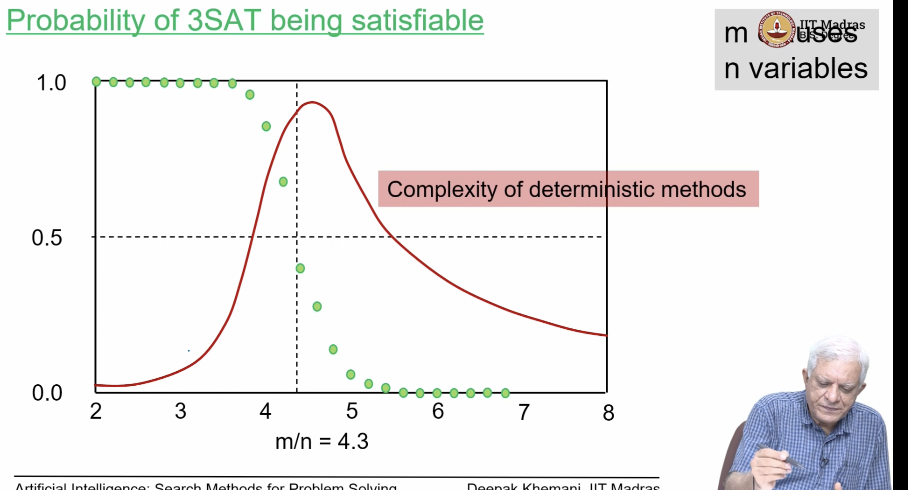
  - the above picture shows the probability of 3SAT being satisfiable, as the number of clauses increase
  - x axis is the ratio of m/n, where m is the number of clauses, and n is the number of variables
  - y axis is the probability of 3SAT being satisfiable
  - it varies like the green curve in the above picture
  - what are the parameters here?
    - n is the number of variables
    - m is the number of clauses in the formula
    - remember that every sat problem has number of clauses
  - the probability of 3SAT being satisfiable,is very high when this ratio of m/n is less than 4.3
  - somehow at 4.3, the probability of 3SAT being satisfiable drops to 50%, it may not have any solution necessarily, but it may have a solution
  - so as the number of clauses increase(m), the probability of 3SAT being satisfiable decreases
  - also remember every clause has to be satisfied, so if we have 100 clauses, then all the 100 clauses have to be satisfied for the problem to be SATISFIABLE
  - as number of clauses increases, the probability of randomly chosen assignment satisfying all the clauses decreases
  - And note that , this is the exact time where the probability of deterministic method peeks, and the probability of stochastic method peeks

  - 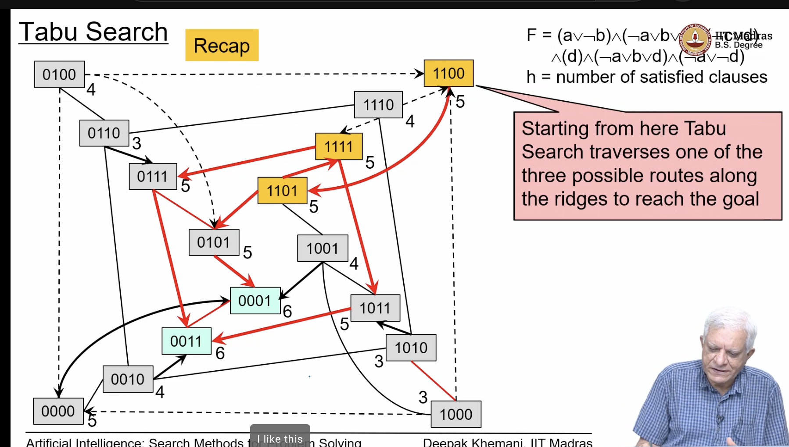
  - this is recap of Tabu search we have seen in the previous lecture
  - we took the formula of 6 clauses and 4 variables, and we tried to find out if the formula is satisfiable or not
  - that's why every candidate has 4 bits (1100,1010,1001,etc..), and we have 2^4 = 16 candidates
  - we also saw how tabu search could find a path from local optima to global optima
  - 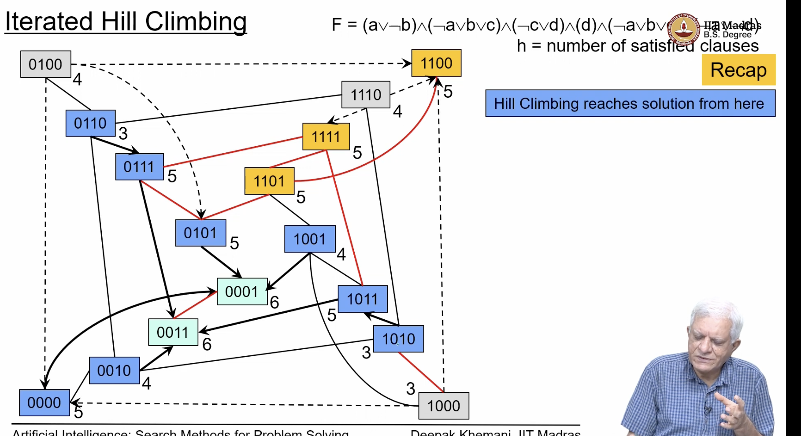
  - we saw that what is the sanctity of starting from one particular point, especially in these solution space search problems, where we are interested in the goal node which satisfies certain property, 
    - in these cases,the fact that we started with something is of no importance
  - We saw that on this small problem the blue nodes are the one from where if we started, Hill climbing will reach a solution essentially  
  - likewise from everyblue node we can reach a solution
  - in this ofcourse, we cant reach a solution from local optima, but we can reach a solution from global optima
  - The question was why not choose different starting points
  - 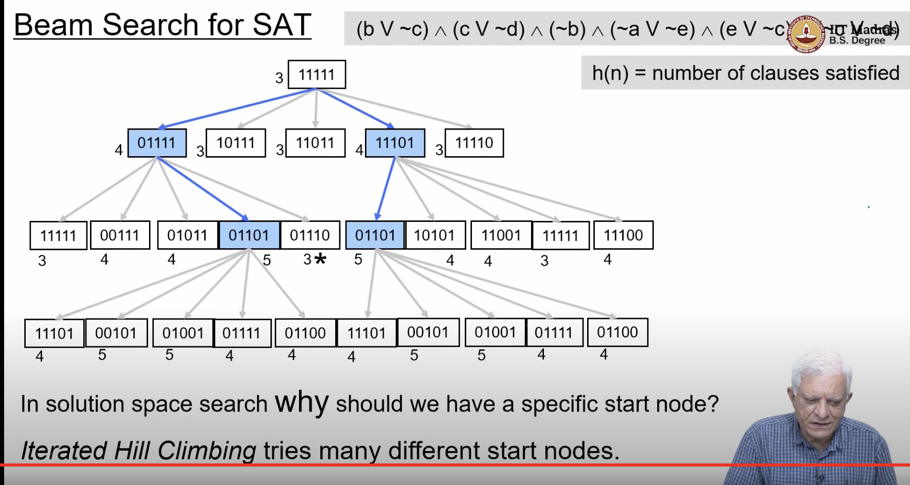
  - This is the Beam search example, we had seen,
    -  we said, we start from 11111
    - we found that after a beam width of two, i.e after two rounds, it reached local maxima, and then in third round it could not reach a heuristic value of 6, 
    - the heuristic function was number of clauses satisfied
    - and since we have six clauses, the solution will have all six satisfied
    - we also observerd that if we started from 01110, which is inbetween the two solution in the image, we 
    would have reached the solution in a different way,
  - ## Iterative Hill Climibing essentially says
    - just try different many start nodes randomly and that's the first flavour of randomness that we have introduced 
    - 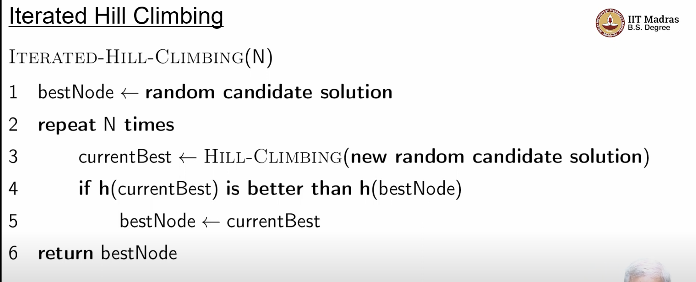
    - the above is the algorithm
      - first choose a random candidate, say that its the best node we have found so far
      - then choose some number N and repeat 
      - starting with a random candidate solution, do hill climbing again 
      - 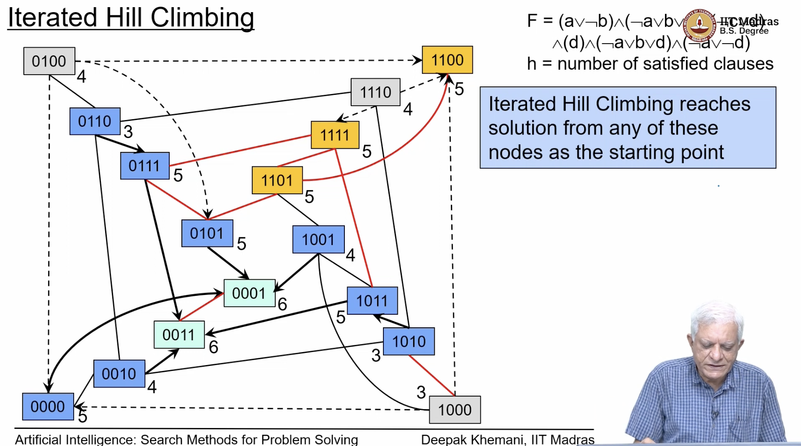
      - this says if we have started at any of the blue nodes, we would have reached the global maxima
      - and if we have started with the global maxima, we would have stayed there itself, 
    - 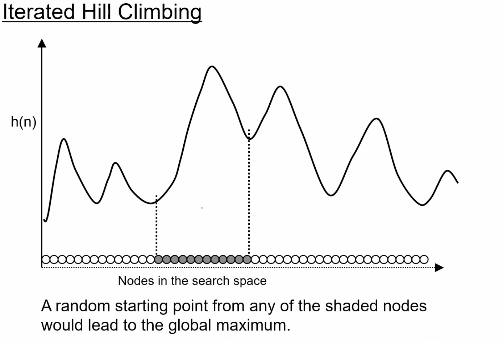
      - This visualizes the advantage of hill climbing
      - if we say we are trying to find the maximum value of the above given function,
      - on the x axis , we have  candidate solutions
  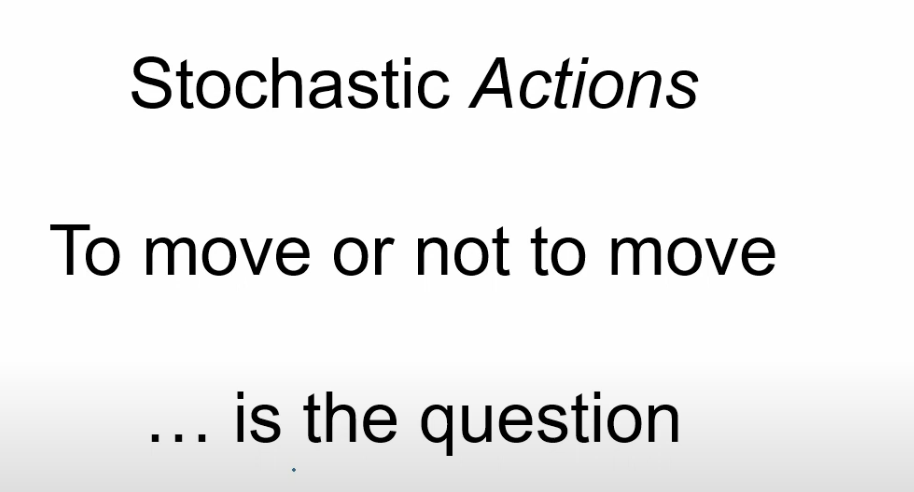