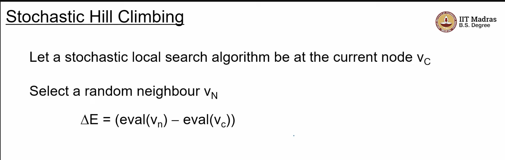
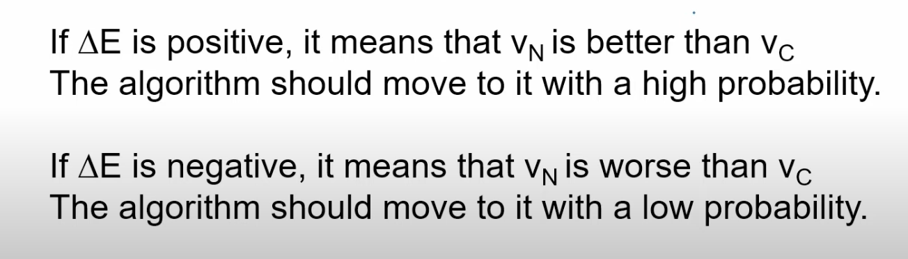

## L4.2: Stochastic Local Search

- in iterative hill climbing we saw that, we choose random starting points , and do hill climibing from all of those points
- For solution space search , the starting point is of no consequence, we can start from anywhere , its the goal we are interested in 

- Lets look at some algos where the actions are themself stochastic
  - i.e we are considering an action, and we want to decide whether to make that move or not
- 
- in hill climbing , we did exploitation of the heuristic function, and it basically follows the gradient
- the opposite of that is Random Walk
- hill climbing is pure exploitation
- random walk does pure exploration
- we want an algo which does the combination of the two
- Algo 1:
  - Stochastic Hill climibing
    - it is like hill climbing except that , we dont necessarily move to the best neighbour hood, we adopt the approch we took for random walk
- 
  - we generate a random neighbour, 
  - V -> Vertex
  - Vc -> c=current Vertex
  - Vn ->  random neigbour
  - and compute the evaluation function
  - we call their difference as delta E
- 
- How are these probabilities computed?
  - we use sigmoid function
  - 
  - the question is  , we are at Vc, and we generated Vn, we want to ask whether to move to that Vn or not to that Vn
  - T is some parameter, 
  - When del E = 0, the P =0.5
  - as Del E increases from 0 , (positive ), the P becomes more than 0.5 and reaches to 1
  - if Del E is negative , it has lower probability
- ## Annealing
  - 
  - cooling is controlled by cooling rate
  - T in the sigmoid function , stands for Temperature
  - 
  - We are looking at an algo called Simulated Annealing
  - it begins with exploration and ends at exploitation
  - This algo is just a variation of Stochastic Hill climbing
  - start with random node, and always keep track of the best node essentially
  - Note : for Large T's the probability for the good and bad moves are equal essentially
  - Large T means we are encouraging Exploration
  - https://youtu.be/Q2v-792oFYs?t=536
- Idea summary:
  - we start at a high temperature, and gradullay cool down the temperature, 
  - what happens is that initially the moves are more random, and gradually as temp lowers they become more and more deterministic and controlled by the gradient essentially
  - The above image algorithm is for `maximization problem`
- The probability if affected by two factors
  - Delta E
  - T

- Lets look at effect of T on P
  - 
  - wkt  P increases as del E increases
  - The algo starts with a Random Walk (T=infinity)
  - as we reduce T, the flat line becomes like a sigmoid
  - in practice Simulated Annealing is a very good optimization method
- The following info is taken from a book called `How to solve it : Modern Heuristics`page 119
- here we are fixing del E at 13, means its a better node, Vn is better than Vc
- -del E, is nothing but Negation of del E
- we do this , because we use -del E in the formula
- 
- We can see that as T decreases  the probability increases, 
- Now lets see the effect of Del E on P
  - we fix T=10,and eval of current vertex to 107
  - 
  - when Del e = 0 , P=0.5, no matter the Temperature
  - as the value of neighbour increases, as it becomes a better node, Remember maximization problem, the probability increases, 
  - as Del E increase, or -Del E decreases, we can see that the probability is tending to 1,
  - for node worse than Vc, the probability is tending to 0
  - we wil make good moves with high probability, and bad moves with low probability
  - 
    - our basic task is to go from one maxima and go to a better maxima
    - https://youtu.be/Q2v-792oFYs?t=1467
    - the intuition is that the , Del E is the energy required to move from one maxima to another maxima
    - from the diagram , Lets say we are at A, if we want to move from A to M, we need to spend Del Ea amount of energy, and if we want to move from B to M, we need to spend Del Eb amount of energy
    - so there is higher probability for Del Ea is less than Del Eb
    - T is saying the , as T reduces ,the P of making a bad move reduces
    - Simulated Annealing in practice, works very well
    - at very low temperature, only good moves are made
  -  
  - The footprint of Hill climbing is very small, 
  - it means of the starting point is in one of the marked location, then HC will succeed, else it will get stuck in local optima