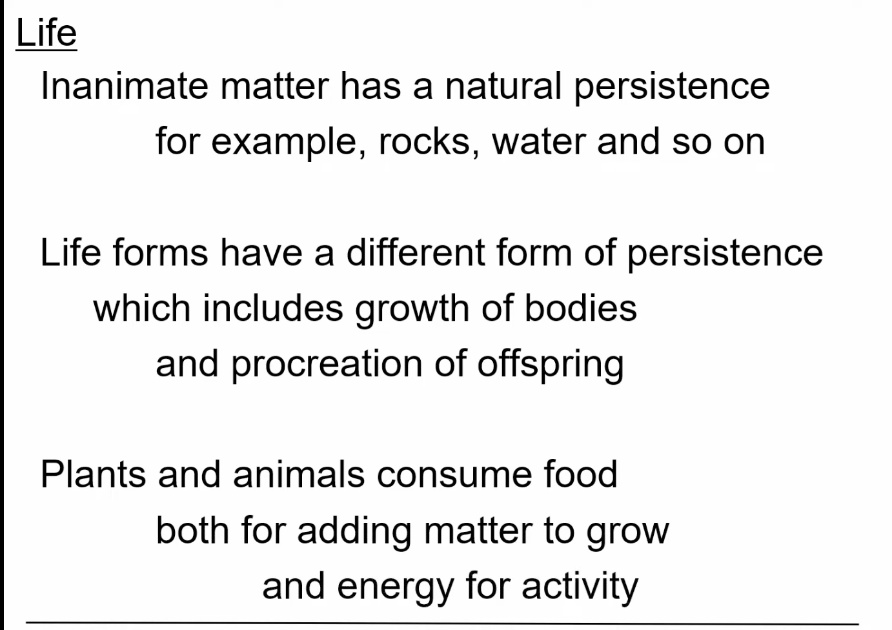
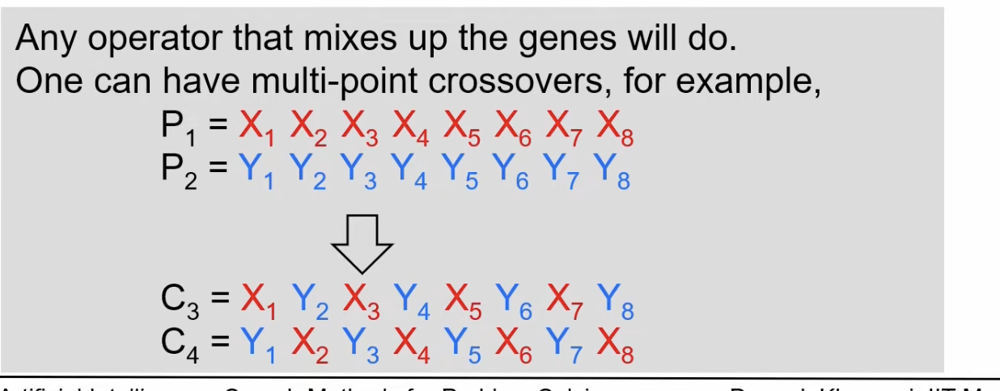

## L4.3: Genetic Algorithms
- Population Based methods
- we are going to work with a population of solutions, instead of a single solution
- 
- 
- 
- 
- 
- 
- 
- Survival of the fittest
- 
- influence diagram, and the flow of positive influence
- Fox -> Lion, 
  - more fox, more lions, 
  - more lions, more bacteria
- 
- 
- everytime nature comes up with a new generation, it selects the fittest individuals from the previous generation
- 
- 
- an instance of Generate and Test
-  
- mixing up happens in the gene level, and the competition happens in the individual level, 
- 
-    
- 
- 
- 
- since P5 has bigger angle than P6, so P5 is fitter than P6
- 
- 
- the arrow determines which genes go to which child
- Note, we select the two parents randomly and we select the cross over point randomly
- consider this as a SAT problem of 8 variables and we produce two children
- 
- idea is just to mix up the genes, 
- 
- https://youtu.be/UVUDOW9OQF0?t=1272
- 
  - we can see that C1 is the best solution, 
  - we have achieved the heuristic value of 6
  - 
  - 
  - 
  - in practice for genetic algo to work well we need large and diverse population
  - 
  - 
  - 
  - 
  - this here says only two different kinds of individuals left
  - the reason for 0 being in red is, the third gene is missing from all the individuals, means , however much churning, we do , the middle gene will never show up, but middel gene is there in the largest candidate, so we will never reach the largest candidate (11111)
  - This example shows that if we work on smaller population we may loose out on some genes, and population will become less diverse,
  - Cheetah is the fastest animal, but it has very less genetic diversity, and it is very susceptible to diseases
  - Cheetah is a very good example of what happens when we have very less genetic diversity
  - The Cheetah is no longer the fastest animal, because it has very less genetic diversity
  - 
  - 
  - 