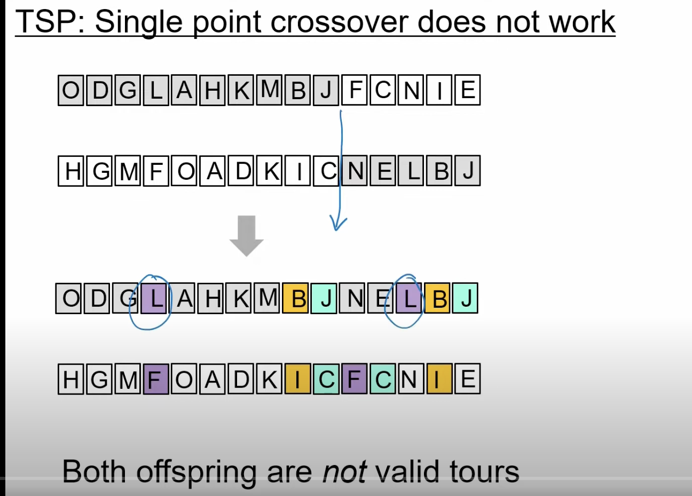
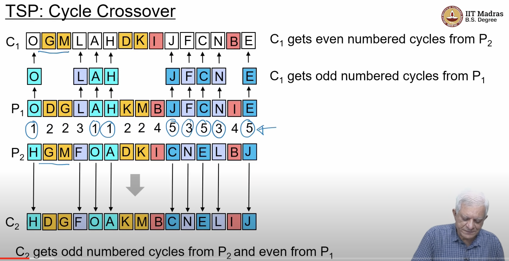
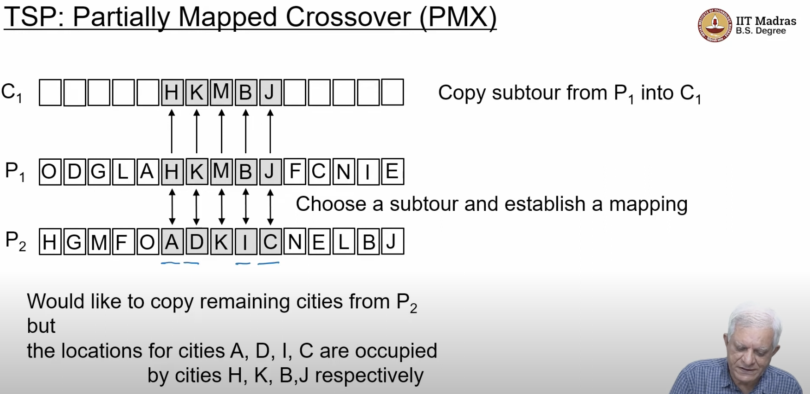
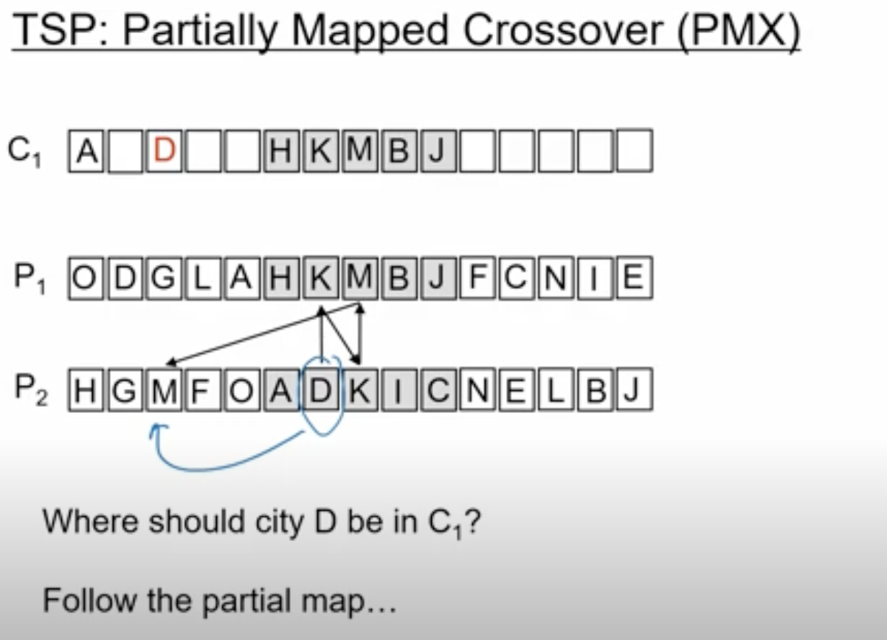
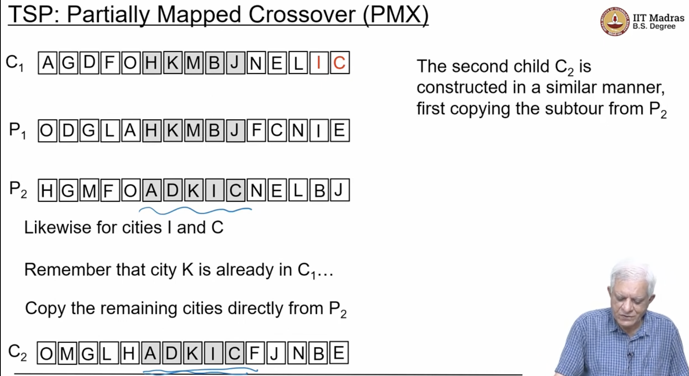
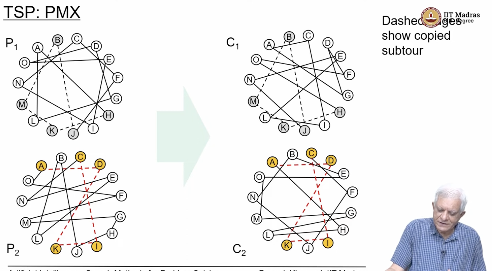
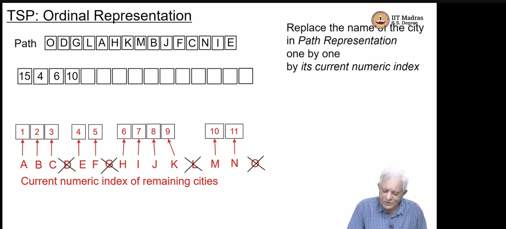

## L4.4: Solving TSP using GAs

- Travelling sales man problem
- 
- 
- children has repeating letters, such as L and B, J
- in TSP , single point cross over as shown above is not a good idea
- we need something more intersting
- TSP : Cycle Cross over
- https://youtu.be/4X0MZVMs4X8?t=216
- 
- 
- 
- ## Partial mapped cross over(PMX)
  - https://youtu.be/4X0MZVMs4X8?t=523
  - 
  -  
  - 
  - 
  - the remaining copies are directly copied from parent2 to child1
  - 
  - 
  - 
  - 
  - after the partial map, we follow the same order and fill the gaps
  - 
  - in adjacency Representation ,we can find from where we came from
  - 
  - 
  - https://youtu.be/4X0MZVMs4X8?t=1010 
  - what are the cross over operations that adjacency representation allows?
  - Note every permutation of the cities is not a valid representation of the TSP problem
  - Why , we came from A to B ,and from B to A, which is a cycle, and cannot be a valid tour
  - 
  - Ans for Q 1 : in path representation every rotation of a premutation represents the same tour   
    - in path representation, every unique tour has multiple representation in the path representation
    - this is not the case in adjacency representation,
  - Q 2 : How many representations does a tour have in Adjacency representaiton?
    - Ans : Not 1
  - BACD tour = DCAB tour, in path representation
  - but in adjacency representation, BACD tour != DCAB tour
- Adjacency Representation cross over Operators
  - Alternating Edges Cross Over:
    - Note in Adjacency Representation, we can know from which city we are going to which city, without actually traversing the tour, 
    - https://youtu.be/4X0MZVMs4X8?t=1152
    - So construct the child as follows
      - start with some city X, and choose the next City Y from P1
        - this is easy because we can go to the index of the city , and find what is the city , that we are going to from there, essentially
      - then from city Y, choose the next city from P2
      - and so on...
      - in some sense , we are choosing alternate edges from the two tours essentially,
    - if we start from City A, and if in Parent 1 if we are going from A to F, then put that A to F, in the Child then see from  `NOT UNDERSTANDING` https://youtu.be/4X0MZVMs4X8?t=1191
    - In Alternating Edges cross over we pick one edge from one parent and other edge from the other parent, and keep construciting a tour
    - In alternating edges, we might get same cities and also we might get dead end aswell
    - We have to be careful that, not every way of constructing this will be a tour
  - Heuristic Crossover
    - 
    - we want to construct shorter tours
  - Adjacency representation , facilitates these choices
- We have to be careful when constructing childrens of Adjacency representation
  - 
    - but C is already in the tour
    - choose random next city
  - these are the devices , that we are building so that, we can do genetic algorithms,
  - We need to construct a population of cities, and keep churning the population to develop new tours essentially
  - Only thing about TSP is , we have to careful , that not every permutation of N cities is a valid tour in Adjacency repre
- Ordinal Representation : 
  - we start with an index as before,  we use numerical representaion of the remaining cities, Ofcourse all cities are remaining cities initially , so 
  - we want to convert path repr to ordinal repr,
  - we start with city O, Replace the name of the city in the path representaion one by one , by its current numeric index
  - we start with O and , write 15 in the first place in the oridinal repr
  - 
  - 
  - 
  - 
  - 
  - 
  - we should figure our a program to write a path representation into an ordinal representation
  - 
  - Next another nature inspired optimixation method