## L4.4: Solving TSP using GAs

- Travelling sales man problem
- 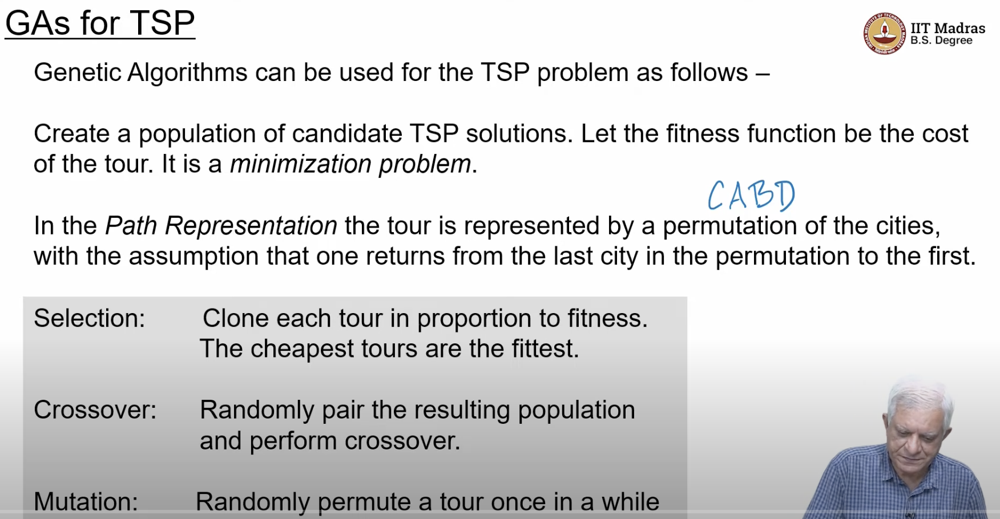
- 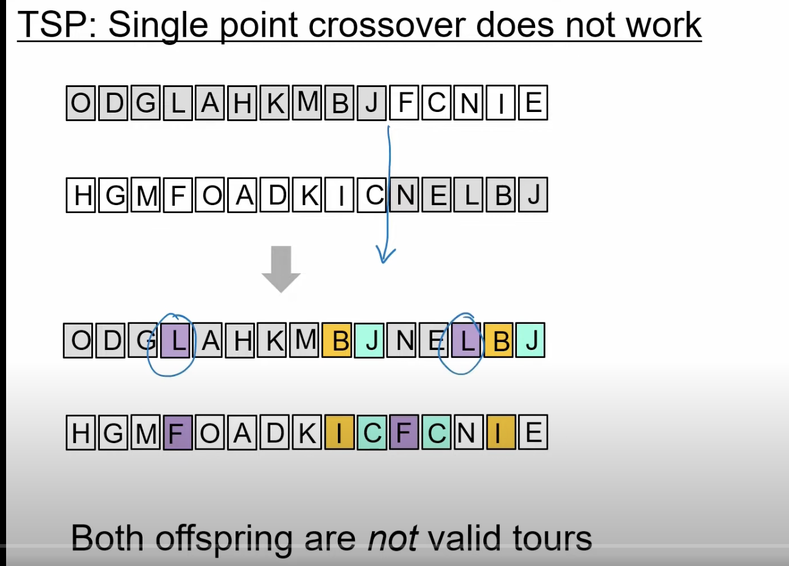
- children has repeating letters, such as L and B, J
- in TSP , single point cross over as shown above is not a good idea
- we need something more intersting
- TSP : Cycle Cross over
- https://youtu.be/4X0MZVMs4X8?t=216
- 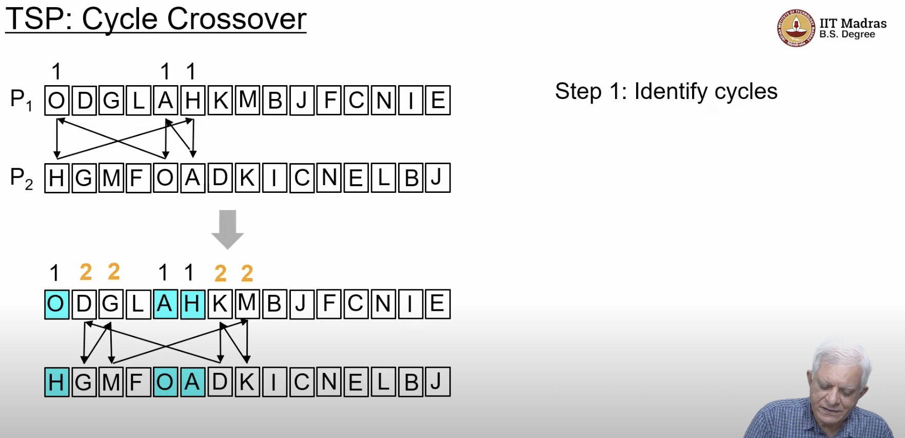
- 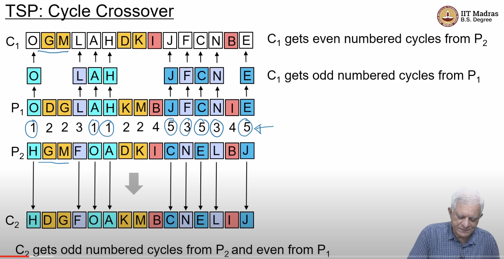
- 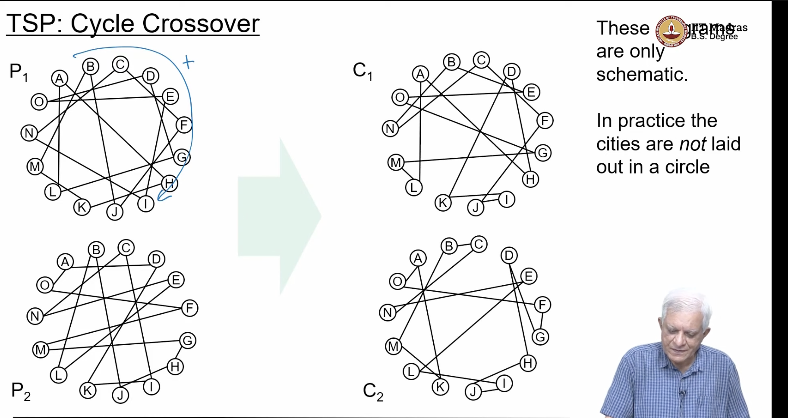
- Partial mapped cross over(PMX)
  - https://youtu.be/4X0MZVMs4X8?t=523
  - 
  - 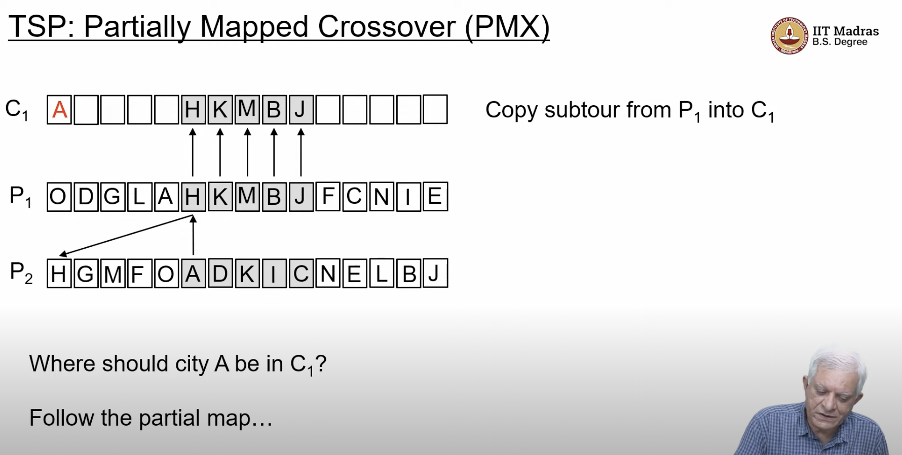 
  - 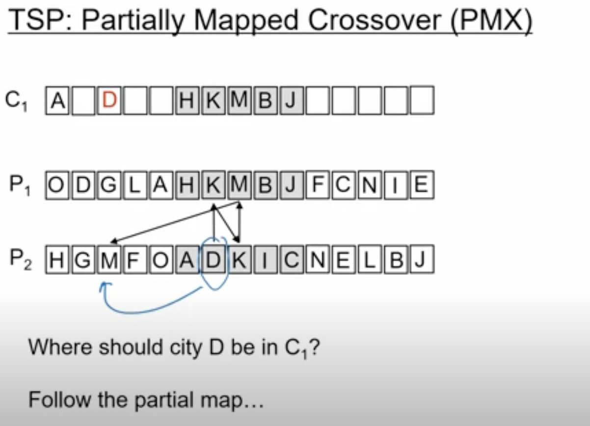
  - 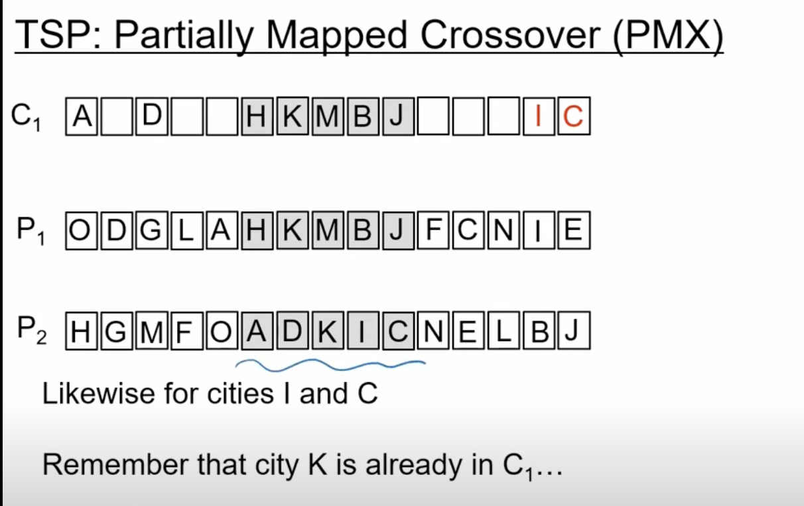
  - the remaining copies are directly copied from parent2 to child1
  - 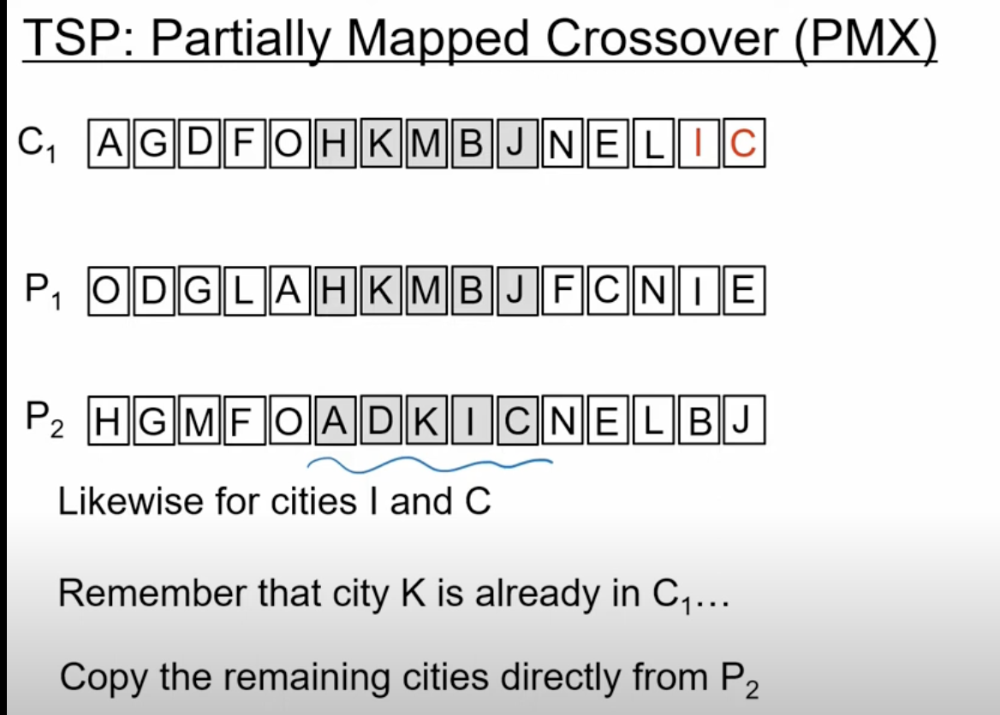
  - 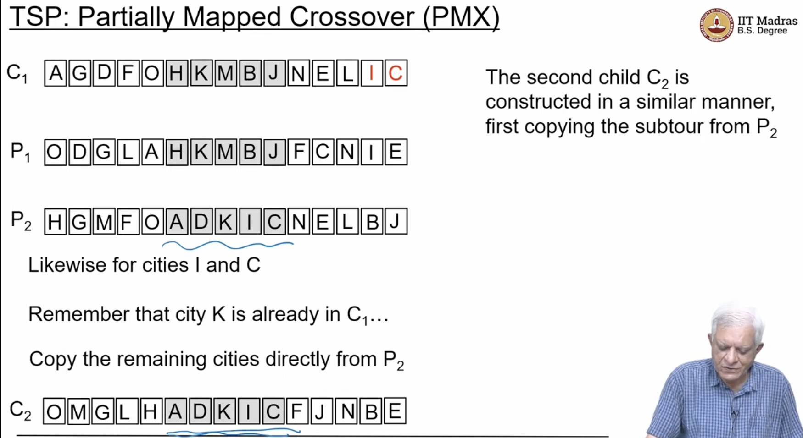
  - 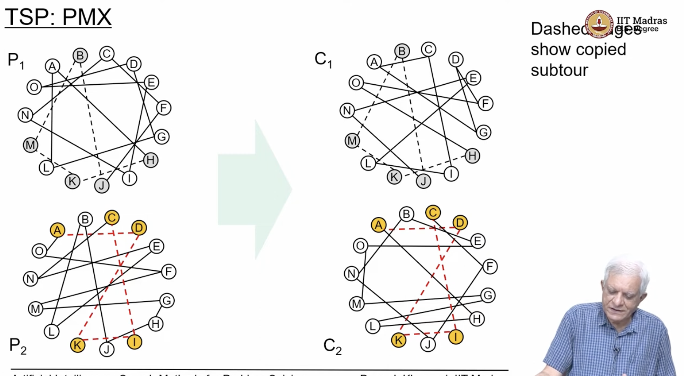
  - 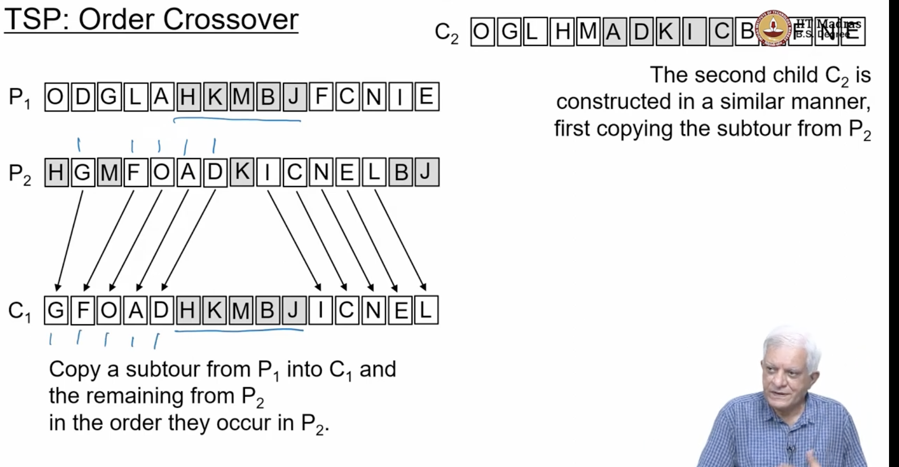
  - after the partial map, we follow the same order and fill the gaps
  - 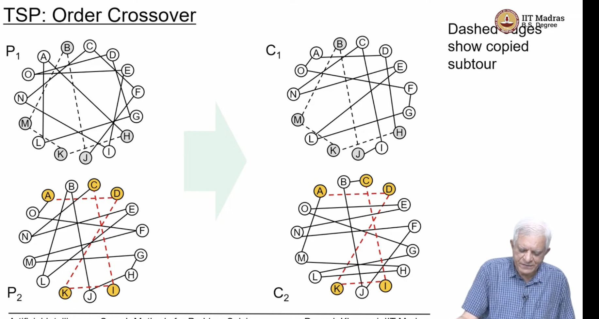
  - in adjacency Representation ,we can find from where we came from
  - 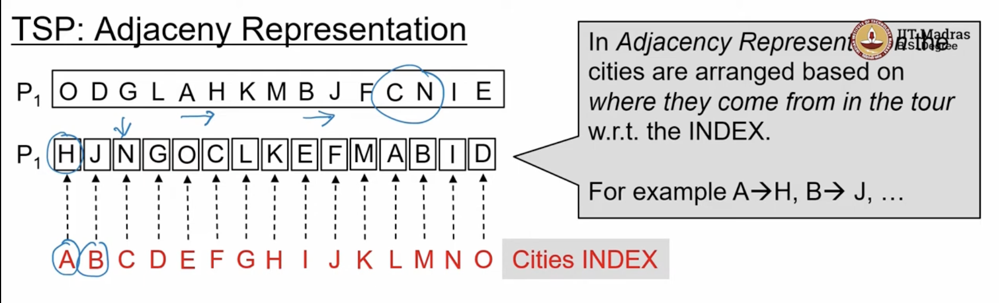
  - 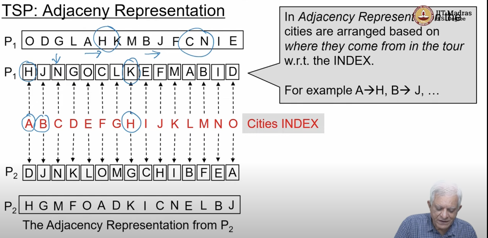
  - https://youtu.be/4X0MZVMs4X8?t=1010 
  - what are the cross over operations that adjacency representation allows?
  - Note every permutation of the cities is not a valid representation of the TSP problem
  - Why , we came from A to B ,and from B to A, which is a cycle, and cannot be a valid tour
  - 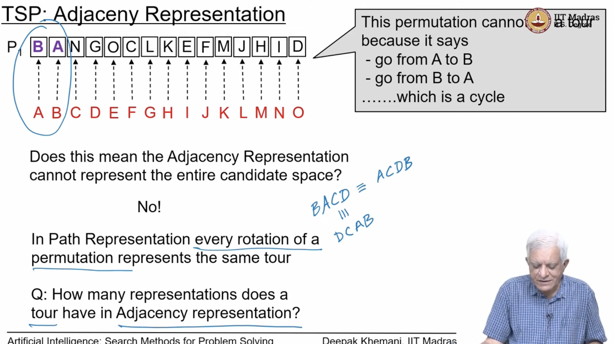