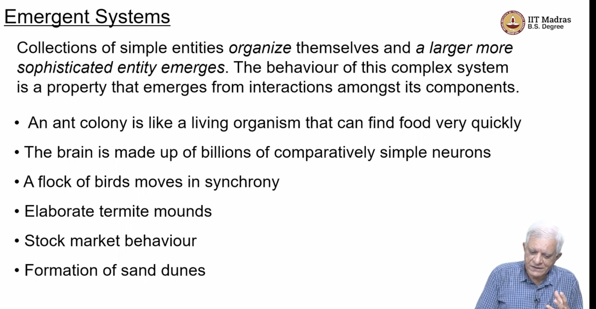

## L4.5: Emergent Systems and Ant Colony Optimization

- 
- often studied by ppl who study complex dynamic systems
- we are talking about self organization
- 
- Hurricanes and cyclones
  - it not one monolothic activity, but the temp of air is manipulating individual air molecules to move around, and we can see spiral in a cyclone
- infinite array
- cells are influenced by these rules
- 
- when there are exactly 3 neighbours alive, then dead cells become alive called as resurrection
- 
- https://youtu.be/jESJ6pG6oPU?t=301
- black shows they are alive and white shows they are dead
- cells keep coming alive and dying, but gives us impression that there is some emergent creature that is traversing down the stream
- idea is that simple rules can give rise to complex behaviour
- same idea is followed in Chaos and Fractals
- Fractals are never ending patterns
- 
- if we take images of coastline and we keep zooming in , we will see images will look similar
- 
- https://youtu.be/jESJ6pG6oPU?t=537
- 
- the more we zoom in the more it looks the same, these are infinitely recursive patterns that are repeated essentially, 
- 
- 
- 
- 
- 
- 
- 
- 
- 
- how complexity can emerge from simplicity
- 
- lets see how ant's cooperate and form cohesive corporate structure
- 
- pre linguistic meaning making
- how symbols which are chemicals and physical symbols , and we interpret it as meaning by other life forms, 
-   
- 
- 
- 
- 
- stochastic greedy method is to follow the pheromone to a large extent probabilistically, using a combination of heuristic and pheromone trail following
- 
- 
- initially we dont have a best tour
- 
  - we shall look at the above algo in detail
    - first randomly place M ants on N cities
    - for each ant a, construct a tour of N cities
    - at every point it selects an edge from a distribution which we will see, based on the probability for that  particular edge
    - after it constructed the tour, we keep track of the best tour
    - then we look at how to update the pheromone
    - for each edge uv , in the ant's tour, we deposit pheromone , which is   inversely proportional to the cost of the tour found by the ant
      - pheromone `()(` to 1/tour length on edge (u,v)
      - ant's which find shorter tours will deposit more pheromone, and the ants which find longer tours will deposit less pheromone   
    - Lets see how this greedy tour is constructed
    - 
    - will kth ant move from city I to city J
    - https://youtu.be/jESJ6pG6oPU?t=1466
    - P Kth ant moving from city i to city J at some point t
    - the probability is governed by two factors
      - amount of pheromone on edge ij 
        - remember that ant has to choose between some number of edges or some number of cities that it has to go to, and it looks at how much pheromone the edges has
      - neta ij , which is inversely proportional to the distance between the cities i and j

    - it has two tendencies,
      -  it tends to go to the cities that are closest (greedy search algo)
      - follow that edge that has more pheromone on it
    - allowed cities means, we dont want to allow premature cycles to be formed
    - of all the edges it can consider, it tries out all of them for all neighbours which are allowed , it computes this, and it picks the node with the highest probabilities, and it can move to that, 
    - also it can move to any one of the neighbours, but it will do it based on amt of pheromone and visibility of how close it is
    - Hence its a greedy tour construction , except that it is not deterministic greedy , it is stochastic greedy , the probability of moving from city I to city J, si given by these two factors
    - How does it update pheromone ?
      - 
      - n = number of cities
      - Q/Lk
        - Q - amount of ph
      - remember every any will not traverse every edge
      - n cities , so n time steps to construct a tour, so we look at the pheromone at time t, some of them evaporates
      - https://youtu.be/jESJ6pG6oPU?t=1754
      - 

      - Next will be A star algo, which is used for finding optimal path in route search